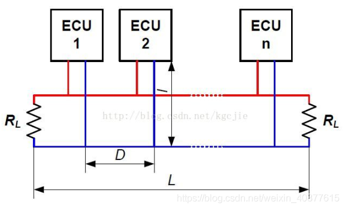

## 原理图及PCB设计

#### 立创EDA

功能不及AD，但新手友好的PCB设计软件，从设计到加工一条龙服务

网页版就行[立创EDA(标准版) - 免费、易用、强大的在线电路设计软件 (lceda.cn)](https://lceda.cn/editor)

......

### 常用通信协议的电路连接

#### 串口USART

​		每一个支持串口的元件都至少有三个端口：RXD，TXD，GND。RXD为接收端，TXD为发送端，GND为地。当A机和B机需要进行串口通信时，需要有3根线连接，连线的方法如下：

- A机的RXD连接B机的TXD，确保可以A机接收，B机发送。
- A机的TXD连接B机的RXD，确保可以A机发送，B机接收。
- A机和B机的GND连在一起，确保二者是共地的。

#### CAN

​		CAN以总线形式通信，也就是说，当有n个机器通信时，不需要将它们之间的通信线两两相接，而是将每个模块都连接在总线上。CAN有一个完善的总线通信逻辑，确保不会有多个机器同时占用总线。一般情况下，CAN的接线结构为：

​		每一个连接在CAN总线上的模块，都包含控制器和CAN收发器。在你自己设计的电路系统中，以STM32为例，你如果直接将CAN总线连接在STM32的引脚上，是不能实现CAN通信的。你必须在你的电路系统中添加**CAN收发器**。

​		在RoboMaster比赛中，常用的电路模块，包括A开发板，C620电调，C610电调，M6020电机，都**内置了CAN收发器**，所以直接将这些模块接在CAN总线上即可。

​		机器之间实现CAN通信，只需要将每一个机器通过两根线连接在CAN总线上。这两根线分别是CAN High和CAN Low，一般简写为CANH和CANL，或者直接简写为H和L。H和H连在一起，L和L连在一起。

​		注意，在RoboMaster开发板A板上，有**两条CAN总线，分别为CAN1和CAN2**。接线的时候需要注意哪个元件挂在CAN1上，哪个挂在CAN2上，不要接错。

#### I2C

​		I2C通信和CAN类似，也是总线通信，即各个模块均接在I2C总线上。I2C同样有一套完备的总线逻辑，确保不会有多个机器同时占用总线。

​		I2C总线包括一条**时钟线SCL**，一条**数据线SDA**，一条**GND**。连接时将这些线对应连接到总线上即可。

