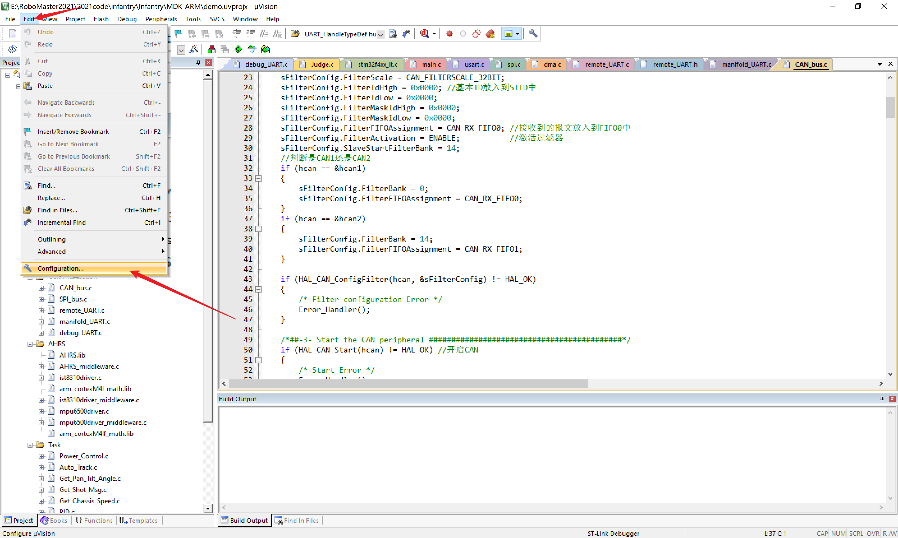

# keil使用细节

## 编码方式和Tab宽度

统一为GB2312比较好支持中文，Tab宽度为4

## 编辑文件树结构

## 添加头文件目录

## 调试器设置

## 跳转

右键跳转到函数定义、变量定义、头文件位置

跳回上一个或下一个位置

## 打开文件所在文件夹

右键

## 搜索

Ctrl+F

替换、搜索、全局搜索，各种选项基本都有用

## 调试！！！

调试模式可以实时监视程序运行状态，功能强大、用法灵活，是Debug的主要工具。

这里标出了最常用功能，实际上还有很多实用功能，慢慢探索吧。

观察窗口，左边输入变量名，右边查看值、修改值

## 未完待续。。。