# 使用CubeMX新建工程并实现LED的闪烁

作者：**薛佳龙**		日期：**2021.9.30**

## 在CubeMX中新建工程

​		首先打开CubeMX

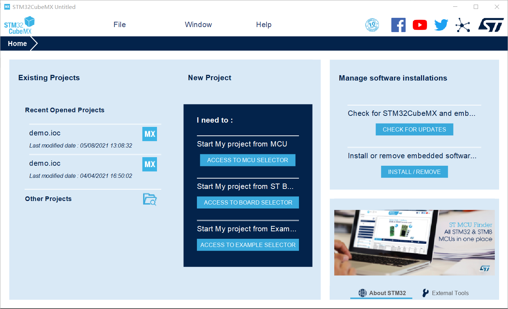

​		接下来要新建一个工程。点击File-New Project，之后进入芯片型号选择界面。

​		实验用单片机的型号为stm32f401ccu，所以在左边Series那一栏找到stm32f4并选中，在右边找到STM32F401CCUx，双击。

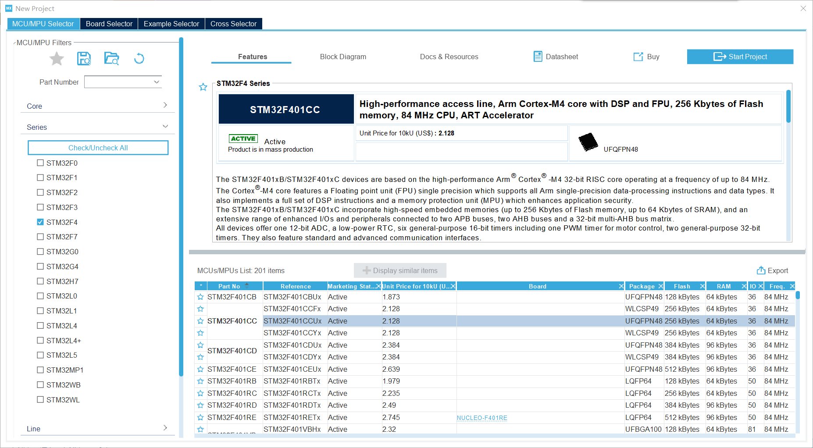

​		进入工程界面，可以看到芯片引脚配置、外设配置、时钟配置、工程配置、工具。

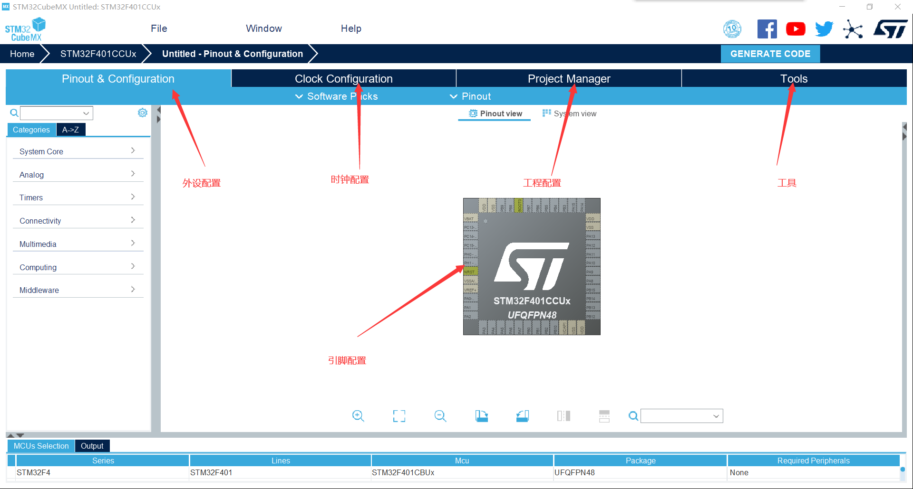

​		首先要配置外部晶振。晶振（晶体振荡器）为单片机提供一个震荡的信号，决定了单片机的工作频率。由于开发板上的晶振并不是芯片制造厂商制作的，而是外围电路上的，所以该晶振叫外部晶振。

​		初学者不必理解晶振的含义和工作方式，只需要知道CubeMX中需要配置晶振即可。如果希望详细了解单片机的工作原理，可以参考课程教材《微机原理与嵌入式系统》。配置方法为：点击RCC，将High Speed Clock设置为Crystal Resonator。

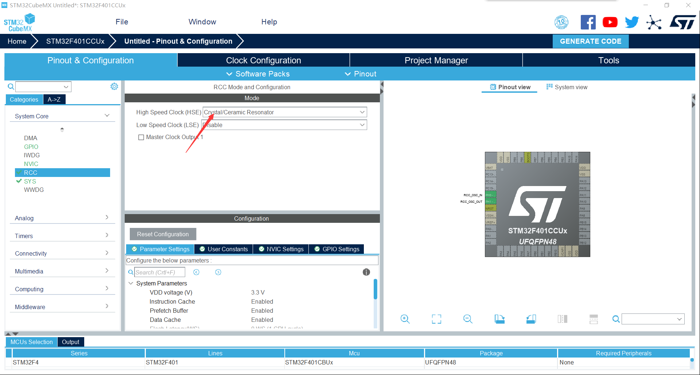		

​		接下来配置调试器，我们使用的是stlink。

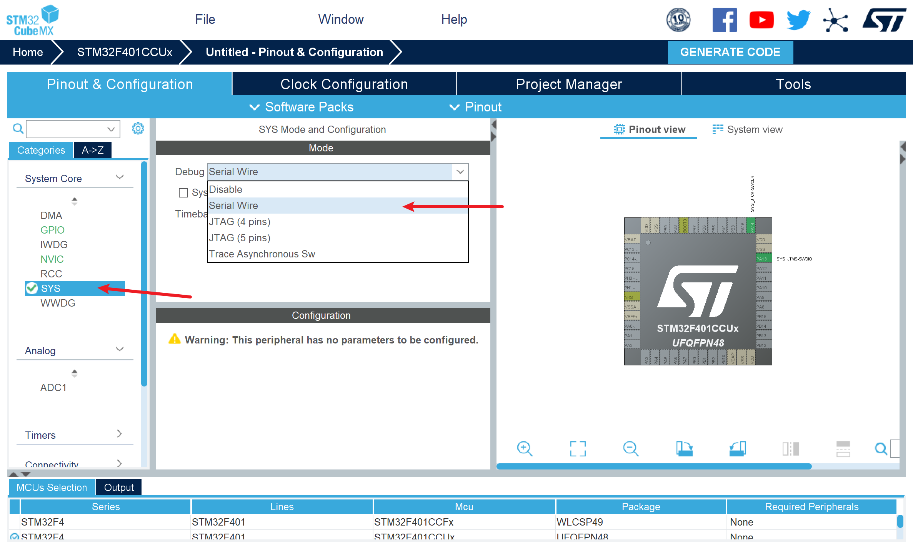

​	接下来配置引脚的输出。点击芯片图的PC13引脚，将引脚设置为输出模式（GPIO_OUTPUT）

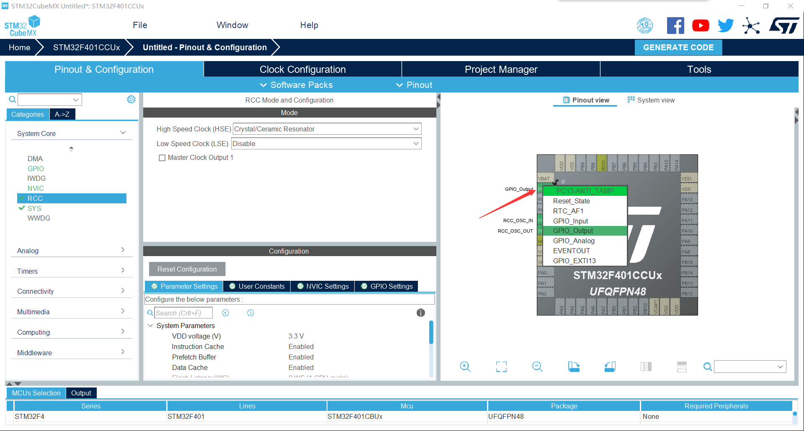

​		最后配置工程。点击Project Manager，填写工程名称，填写要保存的路径，将IDE设置成MDK-ARM。路径中不要有中文。

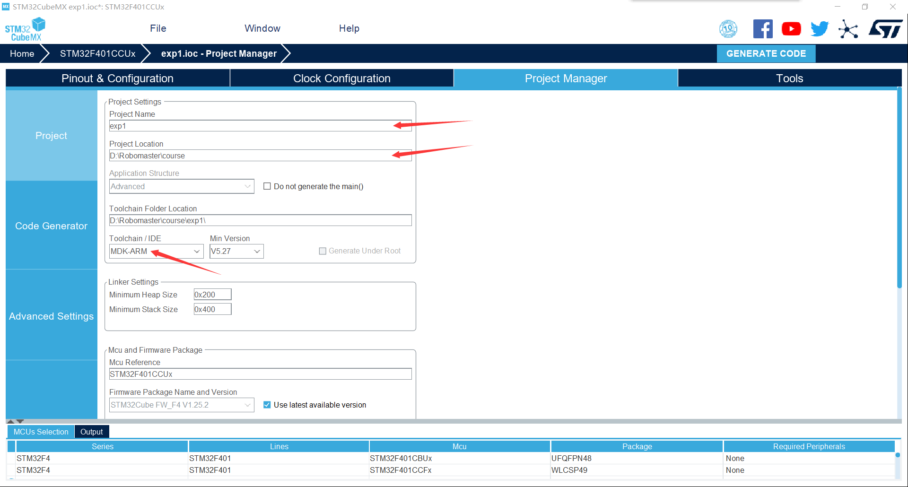

​		点击GENERATE CODE，将在你指定的位置生成keil工程。

## 使用Keil编写控制程序

​		在exp1/MDK-ARM中双击打开keil工程文件

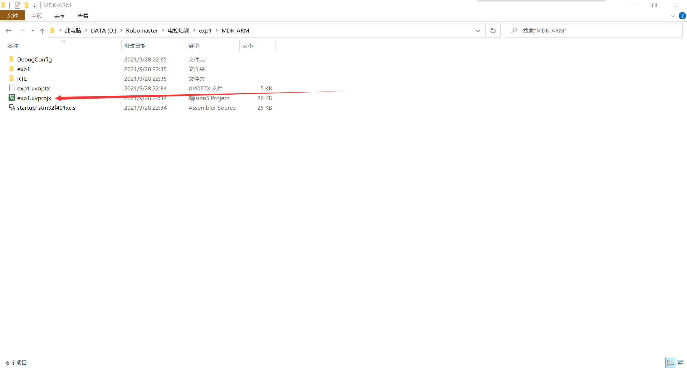

​		可以看到左边的文件目录。本实验中重要的是主函数main。双击打开main.c

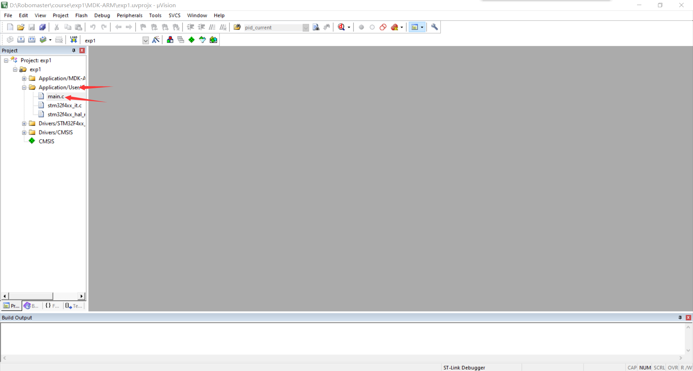

​		往下翻，找到主函数

```c
int main(void)
```

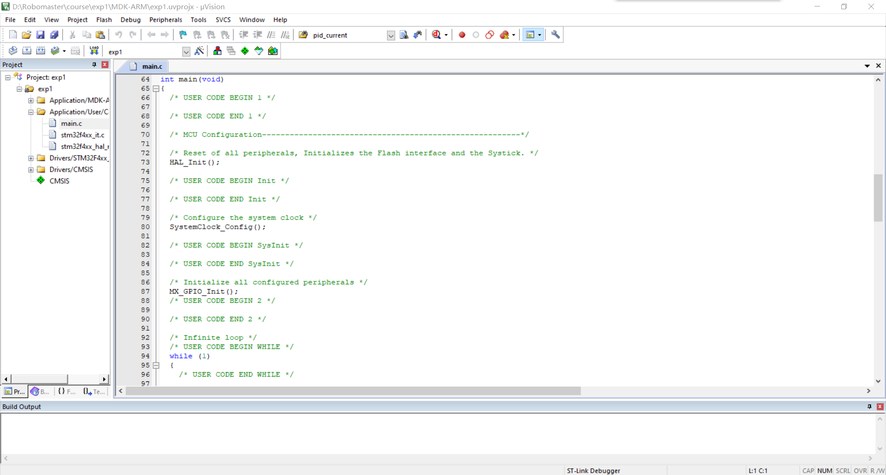

​		在主函数中，先是单片机最开始要执行的初始化函数，之后是单片机要循环执行的任务，在循环体while(1)中编写。

​		先是HAL库的初始化函数，不用理解。

```c
HAL_Init();
```

​		之后是系统时钟的初始化函数，暂时也不用理解。

```c
SystemClock_Config();
```

​		之后是GPIO的初始化函数，你在CubeMX中配置了引脚PC13的输出的时候，CubeMX为你生成了这个函数。

```c
MX_GPIO_Init();
```

​		打开这个函数的函数体可以看到如下代码：

```c
static void MX_GPIO_Init(void)
{
  GPIO_InitTypeDef GPIO_InitStruct = {0};

  /* GPIO Ports Clock Enable */
  __HAL_RCC_GPIOC_CLK_ENABLE();
  __HAL_RCC_GPIOH_CLK_ENABLE();

  /*Configure GPIO pin Output Level */
  HAL_GPIO_WritePin(GPIOC, GPIO_PIN_13, GPIO_PIN_RESET);

  /*Configure GPIO pin : PC13 */
  GPIO_InitStruct.Pin = GPIO_PIN_13;
  GPIO_InitStruct.Mode = GPIO_MODE_OUTPUT_PP;
  GPIO_InitStruct.Pull = GPIO_NOPULL;
  GPIO_InitStruct.Speed = GPIO_SPEED_FREQ_LOW;
  HAL_GPIO_Init(GPIOC, &GPIO_InitStruct);

}
```

​		这些代码的作用是将PC13设置为推挽输出。一些概念将在后面解释。

​		在主函数中的while(1)中写入代码：

```c
while (1)
{
    HAL_Delay(500);	//延时500ms
    HAL_GPIO_TogglePin(GPIOC, GPIO_PIN_13);	//翻转PC13电平

    /* USER CODE END WHILE */

    /* USER CODE BEGIN 3 */
}
```

​		将STLink烧写器的3V3, GND, CLK, DIO四个引脚分别与单片机开发板对应的四个引脚连接。


​		STlink接口

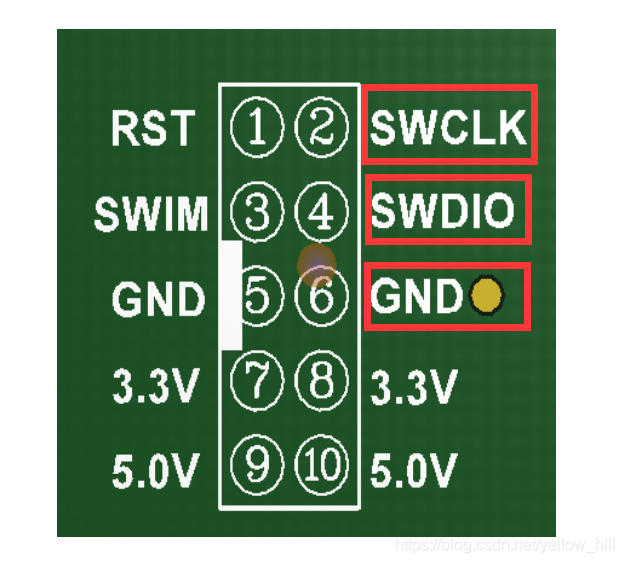

​		连好之后，点击编译，之后点击烧写，烧写完成后，按下单片机开发板的RST复位键，LED灯开始闪烁。

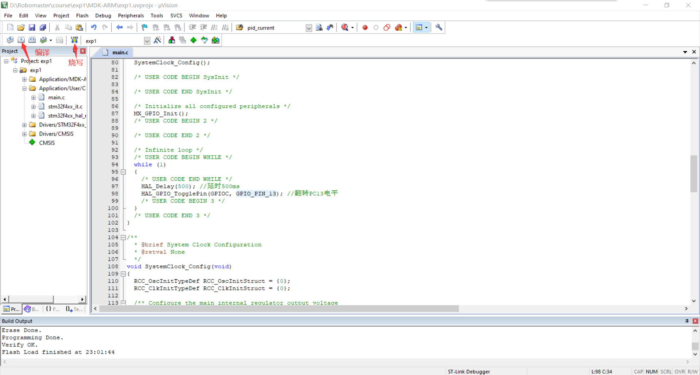

## 错误汇总

#### 烧录一次后无法烧录 报错：Cannot halt the core

​		工程配置里没有选择下载器，将这样的工程烧录进去后，单片机将不会识别下载器，以至于下次无法烧录。

解决办法：配置好设置了下载器的工程后，先按住reset键，然后点keil的下载键，然后立即松开reset，完成一次烧录，之后就可正常烧录。

#### 刚生成的工程编译不通过

​		可能含有中文路径了，删掉cubemx工程以外的文件，重新生成工程。

## 知识点总结

### 点亮LED的原理

​		从开发板的电路图可以看到，LED正极端连接的是VCC，负极端连接的是PC13，中间还串联了一个1K的电阻，起到限流作用。

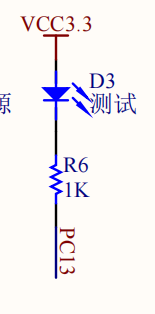

​		

​		单片机的输出接口PC13具有输出高低电平的能力。当输出1，也就是高电平的时候，led（和电阻）两端的电位都是3.3V，电势差为0，没有电流流过，所以不点亮。当输出为0，也就是低电平的时候，led（和电阻）一端电位是3.3V，另一端是0，有电流流过，所以led点亮。

### GPIO输出的配置

​		我们再次查看GPIO配置的代码：

```c
static void MX_GPIO_Init(void)
{
  GPIO_InitTypeDef GPIO_InitStruct = {0};

  /* GPIO Ports Clock Enable */
  __HAL_RCC_GPIOC_CLK_ENABLE();
  __HAL_RCC_GPIOH_CLK_ENABLE();

  /*Configure GPIO pin Output Level */
  HAL_GPIO_WritePin(GPIOC, GPIO_PIN_13, GPIO_PIN_RESET);

  /*Configure GPIO pin : PC13 */
  GPIO_InitStruct.Pin = GPIO_PIN_13;
  GPIO_InitStruct.Mode = GPIO_MODE_OUTPUT_PP;
  GPIO_InitStruct.Pull = GPIO_NOPULL;
  GPIO_InitStruct.Speed = GPIO_SPEED_FREQ_LOW;
  HAL_GPIO_Init(GPIOC, &GPIO_InitStruct);

}
```

​		第一句话，定义GPIO配置的结构体。设置好结构体的参数，在HAL_GPIO_Init函数中将结构体传入即可完成配置。

```c
GPIO_InitTypeDef GPIO_InitStruct = {0};
```

​		之后两句话，配置GPIOC（PC）和GPIOH（PH）的时钟。本例中用到了PC13，所以重要的是配置GPIOC的时钟。至于时钟是什么意思，当前阶段不要求理解，你只需要知道，STM32为了省电，默认将几乎所有的功能都关闭了，包括GPIOC。你需要通过配置时钟来开启这一功能。

```c
  /* GPIO Ports Clock Enable */
  __HAL_RCC_GPIOC_CLK_ENABLE();
  __HAL_RCC_GPIOH_CLK_ENABLE();
```

​		第四句话，将PC13的默认输出设置为低电平。这就是为什么你没有在主函数写翻转电平时，LED默认是亮的的原因。

```c
  /*Configure GPIO pin Output Level */
  HAL_GPIO_WritePin(GPIOC, GPIO_PIN_13, GPIO_PIN_RESET);
```

​		之后几句话，是GPIO的配置。

```c
  /*Configure GPIO pin : PC13 */
  GPIO_InitStruct.Pin = GPIO_PIN_13; //配置端口为13号端口，也就是PC13
  GPIO_InitStruct.Mode = GPIO_MODE_OUTPUT_PP;	//设置输出模式为推挽输出
  GPIO_InitStruct.Pull = GPIO_NOPULL;	//设置为没有上下拉
  GPIO_InitStruct.Speed = GPIO_SPEED_FREQ_LOW;	//设置为低频工作
```

​		对初学者来说，推挽输出模式如何运行，较难理解，暂时不要求掌握，只需要知道推挽输出模式可以输出高/低电平，且相对于另一种输出模式（开漏输出）具有较大电流的输出能力。感兴趣的同学可以参考链接：

​		[开漏输出与推挽输出](https://zhuanlan.zhihu.com/p/41942876)

​		上拉和下拉在输出模式下一般不考虑，但在输入模式下比较重要。可以参考以下链接：

​		[上拉输入与下拉输入](https://www.zhihu.com/question/432654129/answer/1603907746)

