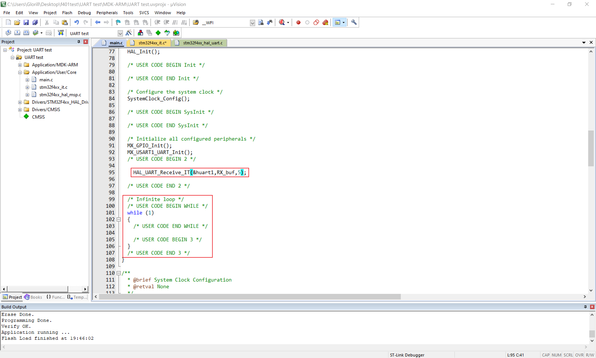
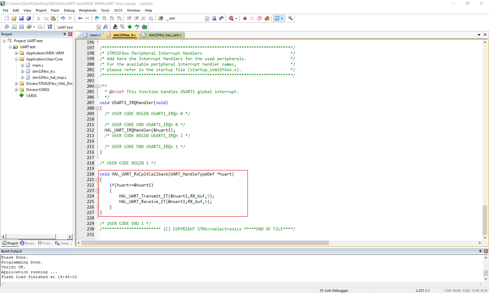

# 串口通信实验

作者：**刘煜川**		日期：**2021.10.3**

**实现单片机与电脑之间的串口通信**

## TTL串口

串行通讯端口是一种结构简单、使用广泛的通信接口，结构图如下。

串行是指，一字节的数据被分为8位，延时间依次传输。

RXD接口（Receive Data）用于输入数据

TXD接口（Transmit Data）用于输出数据

两点之间通信时，**R接T**，**T接R**，通信的双方是**对等**的关系。


串口有多种电压定义和接口，如RS-232、RS-485、TTL。

TTL以5~3.3V为高，0附近为低，与单片机接口电平相符，比较方便。

串口接入电脑可以使用USB转TTL串口模块，最常用的是使用CH340芯片的模块，样式有很多种。


## CubeMX生成工程

新建工程、配置外部晶振、调试器不再赘述。

找到USART1，USART相比UART是多了一些高级功能，我们暂时用不到。

选择异步（Asynchronous）模式，是最常用、最简单的一种模式。


详细配置里，我们主要关心的是**波特率**（Baud Rate），单位Hz，是指每秒多少位数据，它是收发双方约定的一个通信时基。

**波特率**（Baud Rate）115200

**数据长度**（Word Length）8bit

**奇偶校验**（Parity）无

**停止位**（Stop Bits）1

**数据流向**（Data Direction）接收和发送


使能串口全局中断，这是我们接触到的又一个中断。


在GPIO设置里可以看到这个串口的默认引脚，RX是PA10，TX是PA9。


设置工程名、路径、编辑器、生成工程，不再赘述。

## 阻塞式发送

阻塞式是指该语句会使CPU一直停在这里，直到发送、接收完毕。

在main.c的主循环中添加发送程序。


定义一个字符串，每隔一秒发送一次。

```c
unsigned char text[10]="test ABC\n";
HAL_Delay(1000);
HAL_UART_Transmit(&huart1,text,10,HAL_MAX_DELAY);
```

HAL_UART_Transmit函数的参数

```c
HAL_UART_Transmit(

UART_HandleTypeDef *huart, //串口的结构体指针，指明是对哪个串口操作，这里huart1是一个结构体变量，我们应该传入它的地址，所以在前加&

uint8_t *pData, //发送数据的指针

uint16_t Size, //发送字节数

uint32_t Timeout//超时时间，多长时间还没发送完成就退出，设置成HAL_MAX_DELAY是无限时间

)
```

设置一下下载完自动复位运行，编译下载。

将CH340（USB转串口模块）的TX接上PA10(RX)，RX接上PA9(TX)，GND接上，VCC不用接，因为st-link上已经接过3.3v供电了。


将CH340接上电脑，在设备管理器里查看有没有增加这样的设备，没有的话就需要安装一下CH340驱动。


打开串口调试助手，设置你在设备管理器里看到的串口号，波特率等要和CubeMX里设置一致。打开串口，就能看到单片机发来的数据了。


我们接上逻辑分析仪，GND接上，通道0接单片机的TX，开始采集，看一下串口的波形。

新建一个协议分析，选择串口。


通道0，设置一下串口属性，与单片机的设置一致。


右键切换到二进制模式，就能清晰的看出二进制数据与电平变化的关系，是先传输的低位。


右键切换到Ascii模式，就能看到我们发送的原文。


测量一下位宽的频率114KHz，这就是我们设置的115200Hz的波特率。


## 中断式发送

阻塞式发送时，CPU需要一直等待发送的完成，CPU资源浪费在了发送的流程上。

另一种发送方式是中断式发送，CPU只需下达少量的指令，交由串口电路实现发送，电路处理完一次后产生一个中断，再次要求CPU来下达下一个指令，反复直至发送完成。发送全程中CPU参与的时间很少。

只需在主函数中改用中断式发送函数，与阻塞式的区别在于这句发送语句几乎是瞬发的，CPU不会停留在这里，而发送的过程将在后台的一次次中断后完成，HAL库帮我们实现了这个依靠中断的发送流程。


```c
	unsigned char text[10]="test ABC\n";
	HAL_Delay(1000);
	HAL_UART_Transmit_IT(&huart1,text,10);
```

HAL_UART_Transmit_IT函数的参数

```c
HAL_UART_Transmit_IT(

UART_HandleTypeDef *huart, //串口的结构体指针

uint8_t *pData, //发送数据的指针

uint16_t Size //发送字节数

)
```

编译下载，打开串口助手就能收到消息。

## 定长度中断式接收

在main.c开头的用户变量区定义一个数组作为接收缓冲区。


删掉主循环中之前的语句，在主循环之前开启一次中断式接收。



这里数据个数设置的是5。

```c
HAL_UART_Receive_IT(&huart1,RX_buf,5);
```

编译一下，然后在stm32f4xx_it.c中找到HAL_UART_IRQHandler，这是HAL提供的解决串口中断处理流程，去到定义，里面有点复杂。大概就是：

+ HAL_UART_IRQHandler()中第2371行调用了UART_Receive_IT()；

+ UART_Receive_IT()中第3644行调用了HAL_UART_RxCpltCallback()；

+ HAL_UART_RxCpltCallback()的定义在第2618行。

这个HAL_UART_RxCpltCallback是串口接收完成回调函数，是在接收到指定个数的数据后，会调用的函数，就是我们在开启中断式接收时设置的那个个数。

这个回调函数也是一个虚函数，提供给用户实现。


在stm32f4xx_it.c中实现这个函数



```c
void HAL_UART_RxCpltCallback(UART_HandleTypeDef *huart)
{
	if(huart==&huart1)//因为回调函数被各个串口共用，所以要先判断是哪个串口。
	{
		HAL_UART_Transmit_IT(&huart1,RX_buf,5);//将收到的数据原样发回去。
		HAL_UART_Receive_IT(&huart1,RX_buf,5);//开启一次新的中断式接收。
	}
}
```

在stm32f4xx_it.c开头添加一个接收缓冲区的声明，因为它是在主函数中定义的。


编译下载，打开串口，勾选显示发送字符串。


我们发送一个“123”无事发生，再发送"45"，累计发了5个字节，单片机就会回复我们这5个字节。

至此，我们实现了指定长度的中断式接收，那如果发来的数据不确定长度呢。

## 空闲中断接收

在每接收到一个字节后，如果短时间内没有下一字节的到来，那么将触发串口空闲中断。

HAL并没有提供对空闲中断的处理方式，所以需要自己实现。

在主函数开头初始化串口空闲中断。


```c
__HAL_UART_CLEAR_IDLEFLAG(&huart1);//清除空闲中断标志
__HAL_UART_ENABLE_IT(&huart1, UART_IT_IDLE | UART_IT_RXNE);//开启空闲中断和接收中断
HAL_UART_Receive_IT(&huart1, (uint8_t *)RX_buf, 100);//开启一次中断式接收
```

在stm32f4xx_it.c的USART1_IRQHandler()中添加一段我们自己的处理函数。


```c
if (__HAL_UART_GET_FLAG(&huart1, UART_FLAG_IDLE) && __HAL_UART_GET_IT_SOURCE(&huart1, UART_IT_IDLE)) // 确认产生了串口空闲中断
{
    __HAL_UART_CLEAR_IDLEFLAG(&huart1); // 清除空闲中断标志
    HAL_UART_AbortReceive_IT(&huart1); // 终止中断式接收

    /***数据处理的部分***/
    unsigned int data_len=huart1.pRxBuffPtr-RX_buf; // 获取数据长度
    HAL_UART_Transmit_IT(&huart1,RX_buf,data_len);	// 回发数据

    HAL_UART_Receive_IT(&huart1,RX_buf, 100); // 开启一次新的中断式接收
}
```

编译下载，打开串口。


此时，发送各种长度的数据都会原样回发，如果长度超过设定的缓冲区100则会被截断。

## 注意

在实际使用中，一个完备的串口通信比这里的示例更为复杂。

需要一个定义好的数据包格式。

通信数据包通常会设计特定的包头、包尾用于对齐；增加校验位可以减小数据错误的可能。

对于**定长数据包**，接收时需要考虑数据对齐的问题。

对于**不定长数据包**，串口空闲中断并不是万能的，比如蓝牙串口模块的数据就不够连续，可能会在一段数据中途触发空闲中断。另外的办法：

+ 增加特定结束符

+ 增加描述数据包长度的字段

+ 手动计一定的时间，检测发送的结束