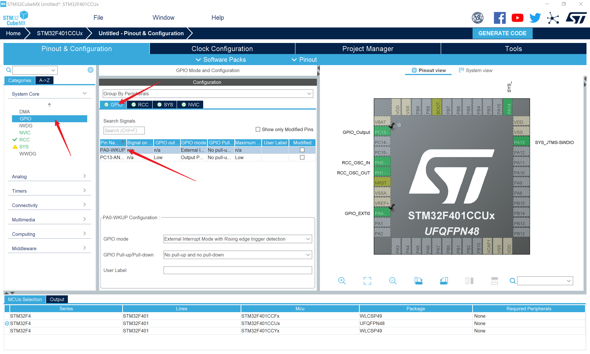

# 外部中断检测按键

作者：**刘煜川**		日期：**2021.10.3**

**我们希望实现按下按键使LED切换亮灭。**

检测外部电平的最简单方式是使用

```c
HAL_GPIO_ReadPin(GPIOx,GPIO_PINx);
```

读取一个引脚的电平是高还是低。

如果需要检测一个按键的按下或者抬起，那就需要快速不断的执行这句代码，才能得到按键的状态。

这样做主要有两个缺点：

+ 反复执行运行这句话，占用CPU资源
+ 当按键状态变化时，需要等到下一次检测的到来时才会得到状态，实时性不好

单片机内部存在一种快速（微秒级）检测外部电平变化的机制，这就是**外部中断**。

外部中断是由单片机内部特殊的电路实现的，STM32的许多引脚都可以配置为外部中断模式，此时该引脚的**电平变化**将会产生一个**中断**，中断会迫使CPU暂停此时正在执行的程序，转而优先执行**中断服务程序**，中断服务程序执行完后再回到原先程序的位置继续执行。

**中断系统**实现了CPU的快速跳转，使得可以灵活快速的实现一些功能。外部中断是系列教程中接触的第一个中断，之后还会接触到各种外设的各种中断。

## 查看原理图


PC13拉低可以点亮D3。

PA0默认设置为高电平时，按下按键可以拉低PA0。那么按下时为什么不会短路呢，因为GPIO在外部中断这个模式下并不会像推挽输出一样输出大电流，仅仅输出一个uA级小电流。如果PA0默认设置的是低电平，那么无论按键按下与否，它都是低电平。

## 在CubeMX中新建工程

​		打开CubeMX，新建工程，芯片型号选择stm32f401ccu。


​		配置外部晶振。

		配置调试器，我们使用的是stlink。


​		配置引脚的输出。


​		配置外部中断引脚。


​		引脚的详细设置。



​		GPIO模式选择“上升沿外部中断”或“下降沿外部中断”，对应于检测按键的抬起或按下。后文采用的是**下降沿外部中断**。


​		GPIO上拉/下拉模式选择上拉，上拉是指在单片机内部通过一个较大的电阻（kΩ级）将IO口接到VCC的模式，因为在上文原理图那里说了这个引脚要默认设置为高电平。


​		使能这个中断，抢占优先级和响应优先级都默认0，中断优先级将影响多个中断同时发生时的响应顺序。


​		时钟树可以不做修改。


​		配置项目名字、路径，注意这两者都不能含有中文，选择IDE。


​		生成工程。


## 按键控制程序

​		在stm32f4xx_it.c中可以找到生成的中断服务函数


​		我们在点击编译后，右键去到定义，查看HAL库提供的外部中断处理策略。


​			此时将跳转到一个hal库内部的文件，在这里可以看到这个函数的实现。这是库内部的文件，用户是不应该修改的。


​		产生中断时会将**中断标志位**置位，首先

```c
if(__HAL_GPIO_EXTI_GET_IT(GPIO_Pin) != RESET)
```

​		检测中断标志位是否被置位，如果置位则继续，否则跳出。

```
__HAL_GPIO_EXTI_CLEAR_IT(GPIO_Pin);
```

​		这句话实现了清除中断标志位，为产生下一次中断做准备。

```
HAL_GPIO_EXTI_Callback(GPIO_Pin);
```

​		这是一个回调函数（callback），是在明确产生中断后调用的函数。

```c
__weak void HAL_GPIO_EXTI_Callback(uint16_t GPIO_Pin)
{
  /* Prevent unused argument(s) compilation warning */
  UNUSED(GPIO_Pin);
  /* NOTE: This function Should not be modified, when the callback is needed,
           the HAL_GPIO_EXTI_Callback could be implemented in the user file
   */
}
```

​		这是这个回调函数的实现，它是一个虚函数（__weak前缀），意思是如果用户没有重写它的实现，那么就会忽略这个函数，如果用户重写了它的实现，那么就会采用用户写的那个实现。这个函数就是提供给用户自定义产生中断后的操作的。

​		我们在stm32f4xx_it.c中重写这个函数，将它的名字复制过去。

		HAL_GPIO_EXTI_Callback()这个函数是所有外部中断线共用的，所以需要用参数uint16_t GPIO_Pin来区分是哪个引脚的中断，这里采用一个switch-case语句判断中断线。

​		注意一个中断线是多个引脚共用的，比如0线同时给PA0、PB0、PC0、PD0...共用，但是同一时刻只能配置给其中之一使用。所以我们这里只判断了GPIO_PIN_0就确定了是PA0，因为0线只配置过PA0。

​		在case中写下执行的语句，这里让PC13电平翻转，实现LED闪烁。

```c
void HAL_GPIO_EXTI_Callback(uint16_t GPIO_Pin)
{
	switch(GPIO_Pin)
	{
		case GPIO_PIN_0:
		{
			HAL_GPIO_TogglePin(GPIOC,GPIO_PIN_13);
		}break;
		default:break;
	}
}
```

​		设置一下ST-Link调试器。


​		勾选下载完后自动复位运行。


​		接上开发版，编译下载。

​		现在按下按键就可以点亮、熄灭LED了。

​		注意到我们全程没有修改过main.c，也就是说主函数里什么也没做，这就是中断的灵活之处，仅仅占用极小的CPU资源，实现快速的响应。

## 按键抖动分析

​		实际上按键这类的机械开关，会存在一个机械上的抖动问题，是指按下抬起的瞬间，会有短时间的（1~10ms）不确定电平，才会稳定。

​		通常会在硬件上加滤波电容，或者在软件上用延时等手段避开抖动的这段时间。


​		我们下面接上逻辑分析仪看一下波形，接上GND，通道0接PA0的按键，通道1接PC13的LED。


​		安装好驱动，打开logic软件，点开始采集。按几下按键后停止采集。


​		滚轮缩放到毫秒级，可以看出并没有抖动，可见这款按键的机械特性比较好，可以不做额外的按键消抖。


​		滚轮缩放到微秒级，可以观察到按键按下和LED翻转的时间差。

​		放置一个时间戳，测得2.917us，可见外部中断的响应是非常快的。


​		在多次试验下，还是捕捉到了个别抖动的情况，这是在一次正常按键抬起前，发生的一次意外跳变，注意时间都是us级别的。


​		针对抖动，这里给出一种解决策略。

​		先在CubeMX中修改一下优先级，使得HAL_Delay()所用的中断优先级高于外部中断（数字越小越高）。使得在外部中断中可以使用HAL_Delay()，生成工程。


​		改一下回调函数，在产生中断后，先延时10ms，度过按键抖动的时间，再判断一次电平是否为低，以此来确认是不是一个下降沿中断。

```c
void HAL_GPIO_EXTI_Callback(uint16_t GPIO_Pin)
{
	switch(GPIO_Pin)
	{
		case GPIO_PIN_0:
		{
			HAL_Delay(10);
			if(HAL_GPIO_ReadPin(GPIOA,GPIO_PIN_0)==RESET)
			{
				HAL_GPIO_TogglePin(GPIOC,GPIO_PIN_13);
			}			
		}break;
		default:break;
	}
}
```

​		编译、烧录、测试。防抖动效果极好。

**注意：这个解决方案比较容易，但并不是好办法，实践中几乎不会这样写**

+ delay函数并不适合在中断中调用，一是会使得无法在主函数中调用（两处同时调用会引发冲突），二是中断函数应该短小精悍，才符合它灵活调度CPU的初衷。要是你急忙让CPU进这个中断，结果进来以后用个delay让它闲着，就很奇怪。
+ 实际中使用机械按键的时候，并不需要多么快的检测，毕竟人也反应不了那么快，一般几十毫秒就足够了。不使用外部中断，而是每隔几十毫秒主动查询按键状态，是一个普适的做法，这样也直接避开了按键抖动的那个时间。
+ 这个实验仅仅以按键为例子介绍外部中断，但实际上外部中断更适合于一些需要真正**快速**响应的传感器。