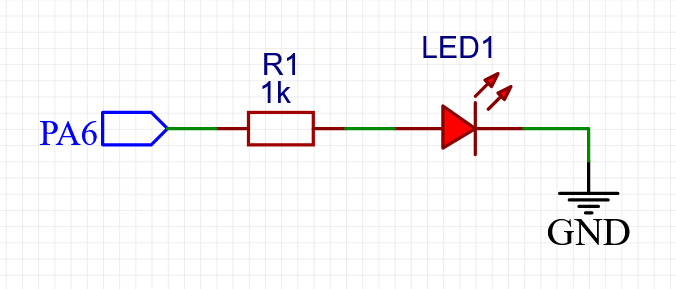

# PWM实现呼吸灯

作者：**薛佳龙**		日期：**2021.10.7**

更改：**麻治昊**		日期：**2021.10.8**

**使用定时器的pwm输出功能实现呼吸灯**

## 预热知识

### pwm脉冲宽度调制

#### 定义

​		**PWM**，英文名Pulse Width Modulation，是**脉冲宽度调制**缩写，它是通过对一系列脉冲的宽度进行调制，等效出所需要的波形（包含形状以及幅值），对模拟信号电平进行数字编码，也就是说通过调节占空比的变化来调节信号、能量等的变化，占空比就是指在一个周期内，信号处于高电平的时间占据整个信号周期的百分比，例如方波的占空比就是50%。


#### 频率

​		频率就是开关速度，把一次开关算作一个周期，那么频率就是 1 秒内进行了多少次开关

#### 占空比

​		占空比就是一个周期内高电平时间和低电平时间的比例，一个周期内高电平时间越长占空比就越大，反之占空比就越小。占空比用百分之表示，如果一个周期内全是低电平那么占空比就是 0%，如果一个周期内全是高电平那么占空比就是100%。

### LED的使用

#### 概述

​		在本实验中，发光二极管（LED）用作呼吸灯。LED是有极性的元件，电流只能从正极流向负极。一般情况下，需要串联保护电阻使用，否则可能会烧坏led或者其它电路系统。

​		本次实验需要使用LED搭建一个简单的电路系统，简图如下：

​		注意：如果是红色二极管，最好加一个保护电阻，其他颜色的二极管无需添加保护电阻



#### “呼吸”的原理

##### 什么叫呼吸灯

​		由亮到暗逐渐变化，很有节奏感地一起一伏，感觉好像人在呼吸。例如，当手机收到消息，屏幕上的指示灯会渐变，比较显眼，能起到一个通知提醒的作用，其实这就是一个呼吸灯。（备注：现在由于手机都在往全面屏发展，因此很多手机取消了呼吸灯这一功能，取而代之的是息屏显示。但这并不妨碍我们使用stm32实现呼吸灯）。

##### 如何“呼吸”

​		使用pwm实现呼吸灯。

​		一般人眼睛对于80Hz以上刷新频率则完全没有闪烁感（因人而异）。

​		频率太小的话看起来就会闪烁，那么我们平时见到的LED灯，当它的频率大于50Hz的时候，人眼就会产生视觉暂留效果，基本就看不到闪烁了，而是一个常亮的LED灯。
​		频率很高时，看不到闪烁，占空比越大，LED越亮（平均电压越大）；频率很低时，可看到闪烁，占空比越大，LED越亮。
所以，在频率一定下，可以用不同占空比改变LED灯的亮度，使其达到一个呼吸灯的效果。

### 面包板的使用

​		面包板是实验室中用于搭接电路的重要工具，熟练掌握面包板的使用方法是提高实 验效率，减少实验故障出现几率的重要基础之一。下面就面包板的结构和使用方法做简单介绍。


​		面包板的外观和内部结构如图 1 所示，常见的最小单元面包板分上、中、下三部分， 上面和下面部分一般是由一行或两行的插孔构成的窄条，中间部分是由中间一条隔离凹 槽和上下各 5 行的插孔构成的宽条。


​		窄条上下两行之间电气不连通。每 5 个插孔为一组，通常的面包板上有 10 组或 11 组。对于 10 组的结构，左边 5 组内部电气连通，右边 5 组内部电气连通，但左右两边 之间不连通，这种结构通常称为 5-5 结构。


​		在搭接数字电路时，有时由于电路的规模较大，需要多个宽条和窄条组成的较大的 面包板，但在使用时同样通常是两窄一宽同时使用，两个窄条的第一行一般和地线连接， 第二行和电源相连。由于集成块电源一般在上面，接地在下面，如此布局有助于将集成块的电源脚和上面第二行窄条相连，接地脚和下面窄条的第一行相连，减少连线长度和跨接线的数量。中间宽条用于连接电路，由于凹槽上下是不连通的，所以集成块一般跨插在凹槽上。

## 实验内容

### 搭建电路系统

​		使用面包板进行电路系统的搭建。选择窄条中的两排，分别接入单片机的3V3和GND。之后借助宽条，依次连接单片机的PA6引脚（TIM3的CH1输出通道）、保护电阻、LED灯、GND。**注意LED灯的连接方向。**


### CubeMX工程配置

#### 时钟树

​		新建工程，配置调试器


​		将时钟源配置为外部晶振。高速晶振必须开启，低速晶振可以开启也可以不开启，一般用不到。


​		打开并配置时钟树。如果不知道怎么配置时钟树，或者对时钟树有不明白的地方，可以再做一遍上一个实验`定时器中断`，或者在网上查一下时钟树的概念。如果希望深入理解时钟树，可以参考《微机原理与嵌入式系统》。


#### 定时器

​		上文系统框图里可以看到，TIM2、TIM3、TIM4、TIM5在APB1总线上，TIM1、TIM9、TIM10、TIM11在APB2总线上。

​		看一下数据手册里的**定时器功能图**

| 名词                     | 翻译          | 解释                                |
| ------------------------ | ------------- | ----------------------------------- |
| Timer type               | 定时器类型    | 高级、通用，高级有更多功能          |
| Timer                    | 定时器        | 定时器名                            |
| Counter reso-lution      | 计数位数      | 用于计数的寄存器的位数              |
| Counter type             | 计数模式      | 向上、向下、中心对齐                |
| Prescaler factor         | 预分频系数    | 预分频系数的范围                    |
| DMA request generation   | 产生DMA请求   | 通过定时器触发DMA                   |
| Capture/compare channels | 捕获/比较通道 | 灵活的输入输出通道，PWM、脉冲捕获等 |
| Complementary output     | 互补输出      | 可以产生两路互非的输出              |
| Max. interface clock     | 最大接口时钟  | 定时器所在总线允许的最大时钟频率    |
| Max. timer clock         | 最大时钟      | 定时器允许的最大时钟频率            |

​		本次实验和上一次实验不同，我们需要使用定时器来输出PWM，而不是使用定时器定时触发中断。所以定时器的PWM功能，也就是捕获/比较通道对我们较为重要。

​		我们接下来要做的是：

1. 选择TIM3。
2. 设置定时器时钟源为内部时钟源
3. 设置定时器CH1为PWM模式。
4. 对应管脚将自动设置为复用推挽输出AFPP模式，不需要手动设置。


​		接下来设置定时器的相关参数。

​		这里面用到了几个参数，下面做一下简介：

- PSC：定时器预分频值，就是把时钟频率进一步降低，参考上一个实验。

- ARR：自动重装载值，这个参数比较重要，首先当定时器计数到达这个值的时候，会重新开始计数。另外，PWM产生的原理是定时器的比较输出，CCRx的值必须小于ARR值。可以理解为，ARR值决定了PWM的“分辨率”。

- CCRx：x为定时器的通道。本次实验用通道一，所以这个值为CCR1。产生PWM的过程为，计数值与CCRx值相比较，相等的瞬间翻转引脚电平。

- 在PWM输出模式下，除了CNT（计数器当前值）、ARR（自动重装载值）之外，还多了一个值CCRx（捕获/比较寄存器值）。

- 当CNT小于CCRx时，TIMx_CHx通道输出高电平；

- 当CNT等于或大于CCRx时，TIMx_CHx通道输出低电平。


​		pwm输出原理示意图如下图所示。


​		我们开始设置定时器相关参数。


​		将PSC设置为100-1，ARR设置为500-1，所以PWM的频率为：
$$
f=\frac{50MHz}{100\times 500}=1000Hz
$$
​		一个pwm周期为1ms。


​		注意到这里有两个参数需要理解，一个是pwm的模式，一个是极性。

​		PWM一共有两种模式，PWM1模式：CNT<CRRx为有效电平。CNT>CRRx为无效电平。PWM2模式相反。那么问题来了什么为有效电平？他又怎么确定？

​		这里有效电平就取决于极性。当极性为High的时候，高电平为有效电平，低电平为无效电平，极性为Low的时候相反。在本次实验中，高电平的时候LED点亮，所以我们应该设置高电平为有效电平，这样占空比才是正确的。（即完全高电平时，占空比为100%，在模式一下CCRx=ARR）

​		pwm的占空比可用如下公式计算：
$$
pulse=\frac{CCRx+1}{ARR+1}
$$
​		配置好定时器之后，我们检查一下GPIO，发现PA6引脚已经自动被配置为AFPP，正确。


#### 工程配置

​		按照之前的步骤来即可。


​		为使得工程文件更加清晰，可以选择为每一个外设创建.c/.h。


​		最后保存并点击生成工程代码。

### 代码编写

​		打开工程文件，找到`main.c`，找到主函数`int main()`。

​		首先在主函数里面定义变量。

```c
  /* USER CODE BEGIN 1 */
    uint16_t pwmVal=0;   //PWM占空比  
  /* USER CODE END 1 */
```

​		注意这里的pwm占空比取值范围为0到499的整数，这是因为之前设置的ARR重装载值为500-1，而这个参数决定了pwm的分辨率。

​		然后使能TIM3的PWM Channel1 输出。

```c
  /* USER CODE BEGIN 2 */
  HAL_TIM_PWM_Start(&htim3,TIM_CHANNEL_1);
  /* USER CODE END 2 */
```

​		在while循环中添加代码：

```c
/* USER CODE BEGIN WHILE */
  while (1)
  {
		while (pwmVal< 500)
	  {
		  pwmVal++;
		  __HAL_TIM_SetCompare(&htim3, TIM_CHANNEL_1, pwmVal);    //修改比较值，修改占空比
		  HAL_Delay(1);
	  }
	  while (pwmVal)
	  {
		  pwmVal--;
		  __HAL_TIM_SetCompare(&htim3, TIM_CHANNEL_1, pwmVal);    //修改比较值，修改占空比
		  HAL_Delay(1);
	  }
	  HAL_Delay(200);
    /* USER CODE END WHILE */

    /* USER CODE BEGIN 3 */
  }
```

​		代码的含义为，在每一个循环中，进行以下过程：

1. 每过一毫秒比较值CCR1加1，也就是pwm占空比增加0.2%，呼吸灯亮度增加，经过500ms也即是0.5秒后占空比加满。

2. 占空比加满后，每过一毫秒比较值CCR1减1，也就是pwm占空比减少0.2%，呼吸灯亮度降低，经过500ms也即是0.5秒后占空比减为0。

3. 延迟200毫秒，之后进入下一个循环。

   设置下载后自动复位，编译、下载，led灯渐亮渐暗，实现呼吸效果，完成。
