# 定时器中断

作者：**刘煜川**		日期：**2021.10.4**

**使用定时器中断完成周期性任务**

## 时钟树

新建工程，配置调试器。

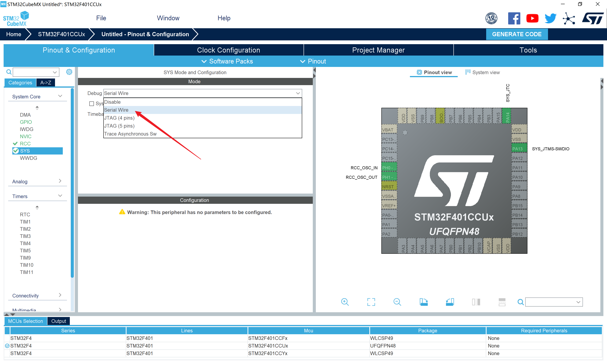

将高速时钟源和低速时钟源都配置为外部晶振

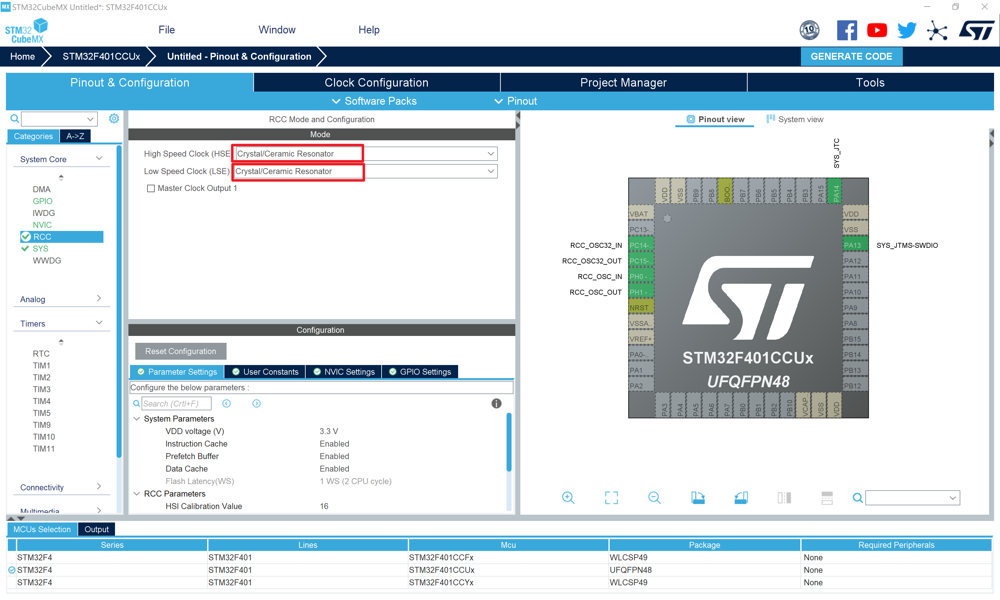

就是电路上的这两个晶振。

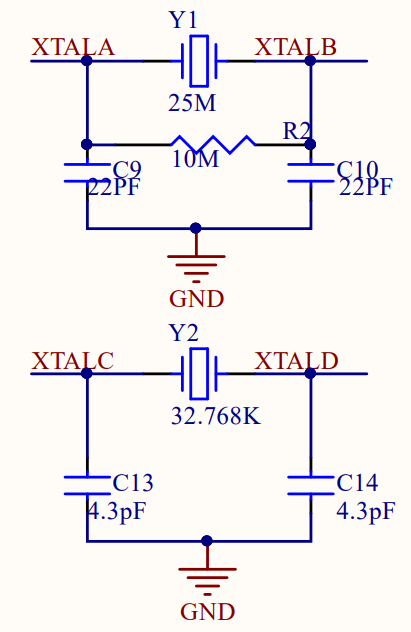

在时钟树中可以看见这两处都开启了

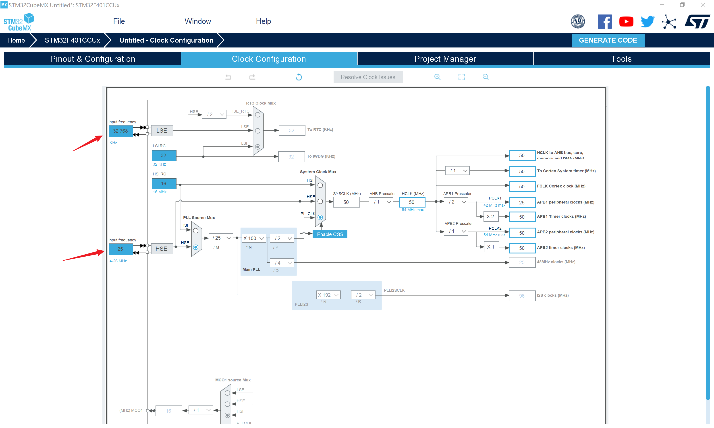

时钟树的一些概念：

+ HSI: High Speed Internal 是高速内部时钟，RC振荡器。

+ HSE: High Speed External 是高速外部时钟，可接石英/陶瓷谐振器，或者接外部时钟源。

+ LSI: Low Speed Internal 是低速内部时钟，RC振荡器。

+ LSE: Low Speed External是低速外部时钟，接频率为32.768kHz的石英晶体。

+ PLL: Phase Lock Loop 为锁相环倍频输出，可以翻倍时钟频率。
+ SYSCLK：系统时钟，是大部分设备工作的时钟源。
+ AHB Prescaler：AHB总线预分频 ，可以对总线进行一次分频。
+ APB1 Prescaler：APB1总线预分频 ，可以对APB1总线进行一次分频。
+ APB2 Prescaler：APB2总线预分频 ，可以对APB2总线进行一次分频。

既然可以用**内部时钟**为什么还需要**外部时钟**呢，一是因为晶振的稳定性、精度比RC振荡器高，二是可以直接接别的设备的时钟源，方便与别的器件同步。

最终时钟提供给AHB总线、APB1总线、APB2总线等。

此外在时钟树下方还有一个输出时钟到外部的设置，了解就好。

在芯片的数据手册里，可以找到内部框图，里面展示了各个设备所在的总线，我们主要关心红框里的设备。

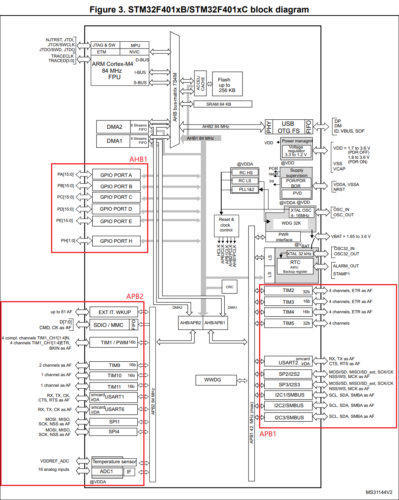

我们把系统时钟设置到50MHz。

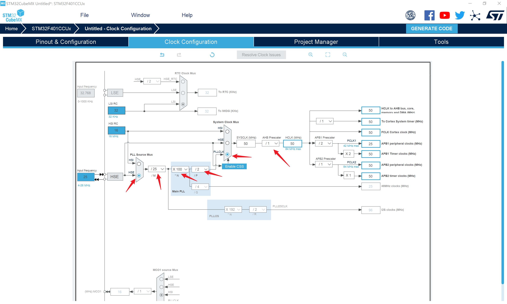

## 定时器

上文系统框图里可以看到，TIM2、TIM3、TIM4、TIM5在APB1总线上，TIM1、TIM9、TIM10、TIM11在APB2总线上。

看一下数据手册里的**定时器功能图**

| 名词                     | 翻译          | 解释                                |
| :----------------------- | ------------- | ----------------------------------- |
| Timer type               | 定时器类型    | 高级、通用，高级有更多功能          |
| Timer                    | 定时器        | 定时器名                            |
| Counter reso-lution      | 计数位数      | 用于计数的寄存器的位数              |
| Counter type             | 计数模式      | 向上、向下、中心对齐                |
| Prescaler factor         | 预分频系数    | 预分频系数的范围                    |
| DMA request generation   | 产生DMA请求   | 通过定时器触发DMA                   |
| Capture/compare channels | 捕获/比较通道 | 灵活的输入输出通道，PWM、脉冲捕获等 |
| Complementary output     | 互补输出      | 可以产生两路互非的输出              |
| Max. interface clock     | 最大接口时钟  | 定时器所在总线允许的最大时钟频率    |
| Max. timer clock         | 最大时钟      | 定时器允许的最大时钟频率            |

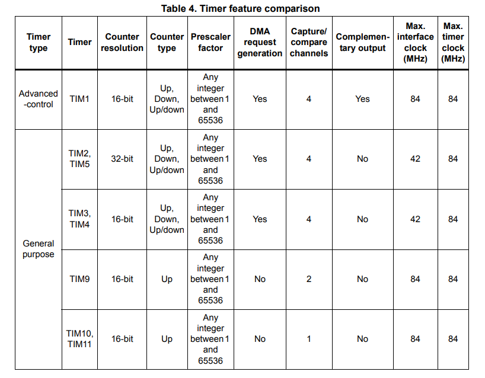

重点关注：

+ 预分频系数，总线时钟进到定时器，首先被预分频器分频一次
+ 计数模式，向上就是每个周期使计数值加1，向下就是减1
+ 计数位数，就是用来存计数值的那个寄存器的位数，16位对应0-65535的值，32位对应0-4,294,967,295。

最常用的是向上计数模式，计数器初始被装载0值，然后在分频后的时钟下逐步计数，直到我们设定的计数溢出值arr，就会发生一次计数溢出，触发一个中断。

定时器中断的频率取决于两个值，一是预分频系数psc，二是计数溢出值arr。

例如：psc取10000，arr取5000，时钟频率50Mhz，那么定时器中断频率就是50M/10000/5000=1hz。

我们选择TIM3，勾选内部时钟，设置psc和arr，注意设置时要减1，因为计数从0开始，使能自动重装载。

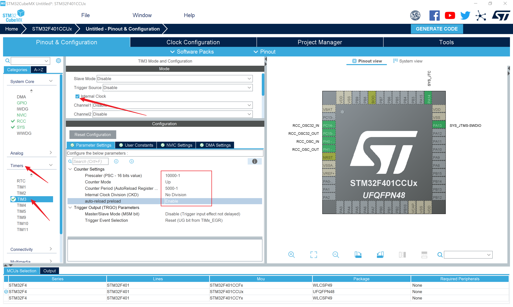

使能定时器全局中断

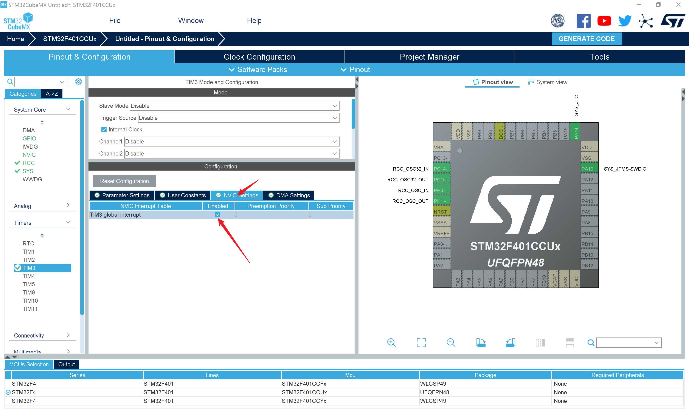

再配置一个LED

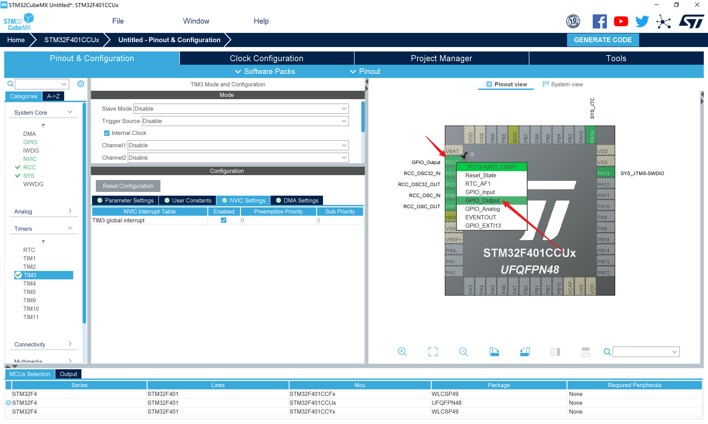

设置工程名、路径、IDE，生成工程。

在stm32f4xx_it.c中找到定时器的中断服务函数，先编译一下，右键去到定义。

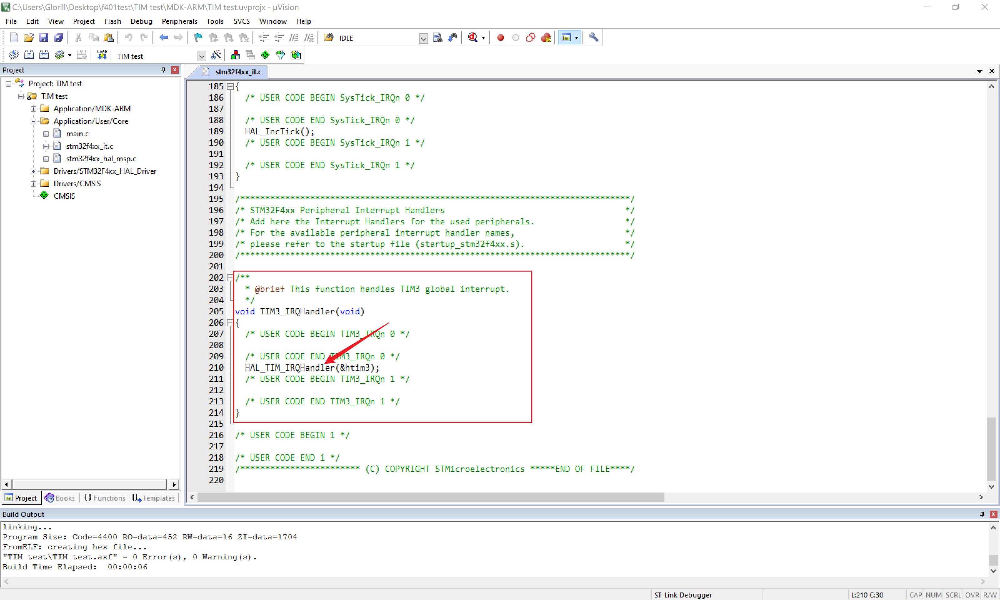

跟之前串口中断类似，里面是HAL库对于定时器中断的处理，我们关心其中的回调函数，其中HAL_TIM_PeriodElapsedCallback()就是我们需要的计数溢出中断回调函数。

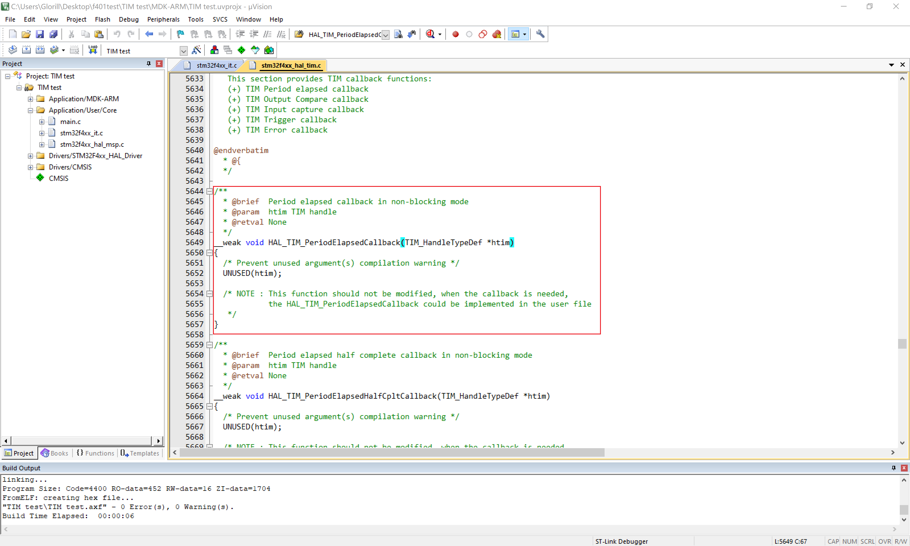

在stm32f4xx_it.c中实现它

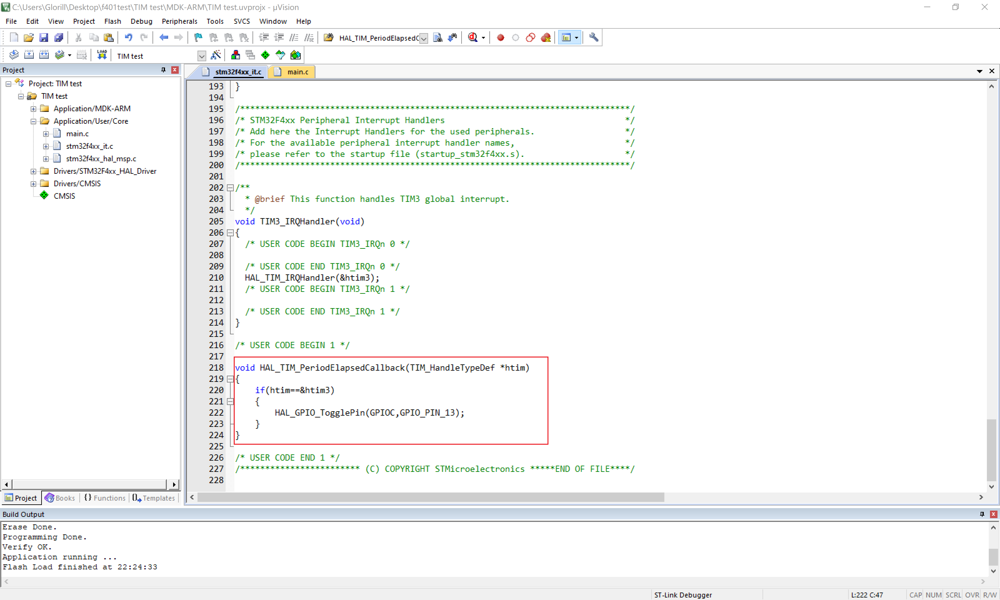

```c
void HAL_TIM_PeriodElapsedCallback(TIM_HandleTypeDef *htim)
{
	if(htim==&htim3) // 判断是哪一个定时器
	{
		HAL_GPIO_TogglePin(GPIOC,GPIO_PIN_13);
	}
}
```

在主函数主循环前的用户代码区使能定时器。

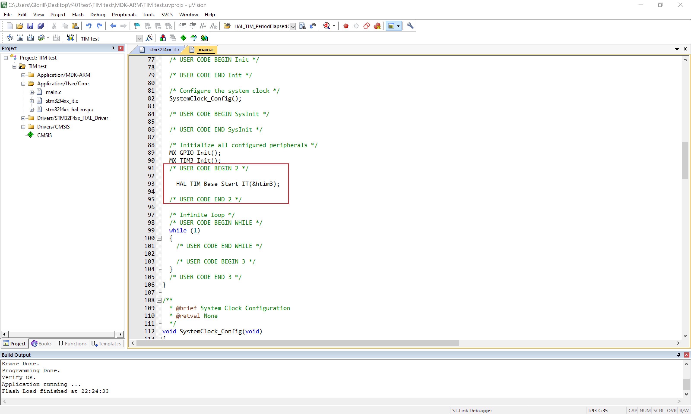

```c
HAL_TIM_Base_Start_IT(&htim3);
```

设置下载后自动复位，编译、下载，LED以1秒为周期亮灭，完成。