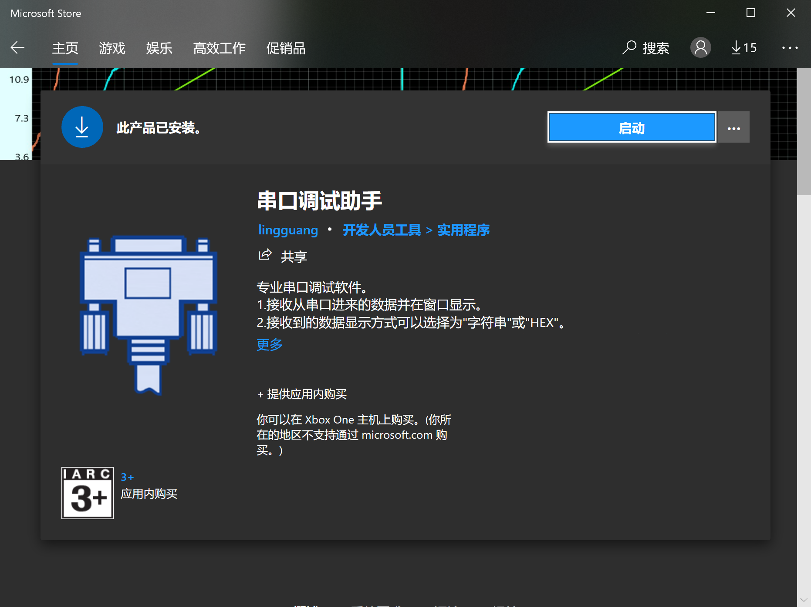

## 环境搭建

**睿客网盘**共享部分软件的远古版本安装包，在**校园网**下体验极佳！

**链接：https://rec.ustc.edu.cn/share/547e7150-1dc9-11ec-8ae0-cb8204a13fb3**

---

### **必要软件**

#### Keil μVision 5

STM32核心的集成开发环境。

---

#### CubeMX

使用CubeMX生成统一格式的基于HAL库的工程。

如果没有安装这个，不影响对已有的工程进行编程，但是没法修改外设的设置以及创建新工程。

---

#### Git

使用Git进行多人合作和版本管理

官网下载：[Git (git-scm.com)](https://git-scm.com/)

基本概念教程：[Git教程 - 廖雪峰的官方网站 (liaoxuefeng.com)](https://www.liaoxuefeng.com/wiki/896043488029600)

基本操作在线教程：[Learn Git Branching (gitee.io)](https://oschina.gitee.io/learn-git-branching/)

可以用git命令行使用，也可以配合VSCode使用

---

#### 串口助手

推荐的串口通信的调试工具

Microsoft Store 搜索 串口调试助手

---

### **依据需要选择**的软件

#### VSCode

颜值极高的万能代码编辑器

通过插件，可以一定程度上融合keil、git等的操作

官网下载：[Visual Studio Code - Code Editing. Redefined](https://code.visualstudio.com/)

[迁移工程到 vscode | ONES Wiki](https://robomaster.ones.ai/wiki/#/team/EjuUfn4A/space/FirkmBAV/page/9wwrhEwd)

---

#### 逻辑分析仪配套软件

官网下载：[Logic analyzer software from Saleae](https://www.saleae.com/downloads/)

---

#### 串口绘图

串口绘图及调参工具

官网下载：[SerialPlot - Realtime Plotting Software | Hackaday.io](https://hackaday.io/project/5334-serialplot-realtime-plotting-software)

---

#### Everything

轻量快速的文件搜索器

官网下载：[voidtools](https://www.voidtools.com/zh-cn/)

---

#### Altium Designer

PCB设计软件

---

#### 立创EDA

功能不及AD，但新手友好的PCB设计软件，从设计到加工一条龙服务

网页版就行[立创EDA(标准版) - 免费、易用、强大的在线电路设计软件 (lceda.cn)](https://lceda.cn/editor)