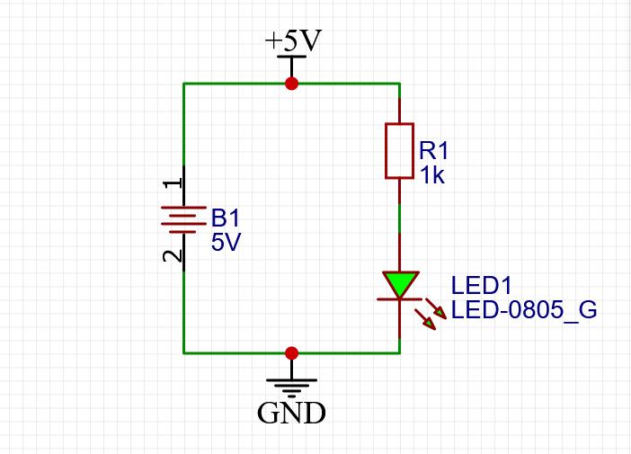

# 电路设计

## 基本概念

### 节点电位

​		一般将电源负极定义为GND。GND只是一个人为的对电位0V的定义，并不是真的要拖一根线在地上。电路其它节点的电位相对于GND来定义。通常只有一个GND，所有模块的GND需要连接在一起。（共地问题）

​		当定义了电源负极是0V或GND后，其余电路的所有节点都可以根据相对GND的电压（或电势差），被赋予一个确切的电位值。

例：使用STM32的pwm控制一个舵机

​		一些符号的含义：

​		GND：地，电位0V。

​		VCC：电路的供电电压，电位可以是5V，也可以是3.3V，自己定义。

​		VDD：芯片的工作电压。取决于芯片的型号，STM32是3.3V。

### 数量级

​		电阻：百Ω，kΩ，MΩ，电流采样电阻mΩ

​		电容：uF，nF，pF，有几十F用于储能的超级电容，用于瞬间快速放电的场景

​		电感： uH，mH

​		电流：控制信号的电流：uA到mA

​					功率传输的电流：A，一个普通24V直流减速电机达到最大扭矩（满载），一般不超过2A

​		电压：3.3V，5V（控制电路、传感器），6V，7V（舵机），12V，24V（电机）

**新电路上电前再三检查，不要将任何元件接到错误的电压上！**

## 基本元件

### 电阻、电容、电感

### 各种二极管

发光二极管、稳压二极管

正向特性、反向特性、击穿特性

### 三极管

电流放大，主要用于电流放大和开关

### 场效应管

电压放大，主要用于大电流的开关

### 运算放大器、电压比较器

可以进行数学运算的电路，还可以进行加减法以及微积分等运算

### 数字集成电路

实现简单的数字逻辑计算，74系列芯片等

### 模拟集成电路

开关电源芯片、电源管理芯片等等

## 数字电路

### 什么是数字电路

用高低电压来表示1和0逻辑的电路，可以实现对数字量进行算术运算和逻辑运算。

高电压和低电压，是相对于GND的电位，常用的TTL电平定义为：2-5v左右为高，0-1v左右为低。

### 芯片的输入输出

​		STM32输出的是数字电位，输出数字信号0表示该引脚的电位是0，输出数字信号1表示该引脚的电位是3.3V，不输出表示该引脚可视为断路。

​		单片机只负责管理电压，不负责管理电流。电流既可以流入单片机也可以流出单片机。比如，点亮一个LED，可以让单片机输出0，另一端接3.3V，也可以把LED反过来，让单片机输出1，另一端接GND。

​		不要用单片机进行大功率输出！

​		**注意：不同的芯片对数字信号”1“的定义不一样，但是常见的标准是3.3V或者5V。各种芯片往往都会对1的定义有一个比较宽的范围，比如当芯片检测到了2.0V到6.0V之间的电压，都会视为外界输入了数字信号”1“。**

