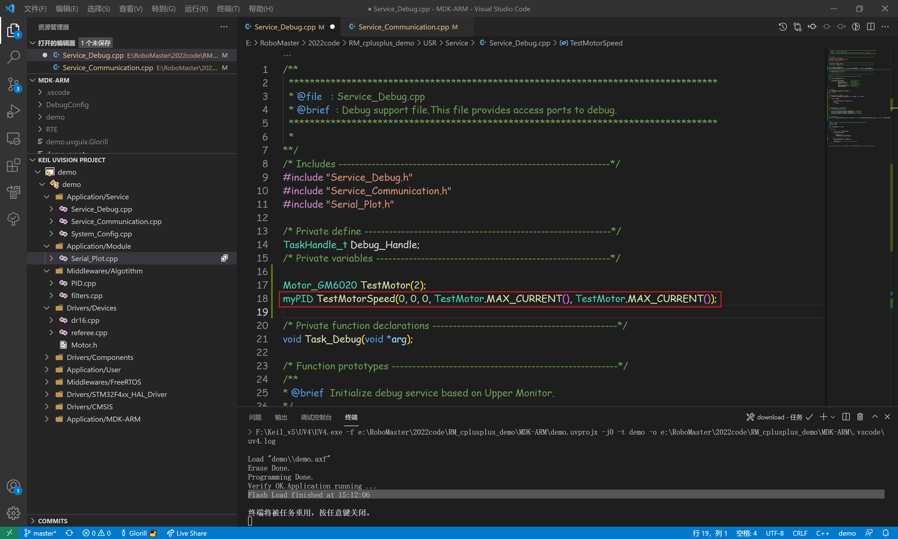

# GM6020速度控制

作者：**刘煜川**		日期：**2021.11.13**

## 目的

使用单个PID实现GM6020速度闭环控制

## 过程

从[RM_cplusplus_demo: RM C++架构 测试 (gitee.com)](https://gitee.com/Glorill/rm_cplusplus_demo)clone代码

或者使用git将代码回到你写上一个实验之前（放弃上一次的修改，或者为上一次修改新建一个分支并提交，然后checkout回到master分支），或者接着上一个实验写也没问题

本次实验需要关注的文件是

+ Service_Debug.cpp    写测试代码的线程
+ Service_Communication.cpp    通信相关的初始化
+ PID.cpp    SRML中提供的PID算法库
+ Motor.h    SRML中提供的RM电机库

注：SRML是华南理工机器人实验室开发的嵌入式软件中间层库，我们借用

### 电机配置

我们打开Task_Debug.cpp，在开头实例化一个电机

类型是“Motor_GM6020”，命名为“TestMotor”，ID为“2”

打开“RM GM6020 使用说明书.pdf”看一眼

链接：[模块资料 | ONES Wiki](https://robomaster.ones.ai/wiki/#/team/EjuUfn4A/space/FirkmBAV/page/QRWTS2ia)

记下**电机ID**为2，**反馈报文标识符**为0x206，**Bit**为010

**Bit**用于电机背后的拨码开关，按上文要求拨好

**反馈报文标识符**用于CAN总线收到电机反馈数据后，区别是哪个电机的数据

打开Service_Communication.cpp，写下这样两行，代码里是已经写好了的，取消注释就好

别的参数可以先不管，因为涉及到CAN总线比较复杂，主要关注箭头

hcan1表示电机在CAN1总线上，0x206就是上文的**反馈报文标识符**

下面的case里是调用TestMotor的接收数据处理函数update()，就是把CAN收到的数据存进这个电机的实例里

这里调用了TestMotor所以需要在Service_Debug.h声明一下

声明的时候是不应该有参数的，所以后面没有括号

使用一根CAN线和一根电源线连接GM6020和A板

电源线接到A板中间12V的接口，CAN线任意接一个CAN1接口

战车上电机的电源线是不会直接接到A板的，因为A板电流不够那么多电机，这里这样接仅仅是方便测试

上电后电机上绿灯每秒闪烁的次数就是设置的ID

### 连接测试

在控制电机之前，需要先检测电机连接正常，传感器回传正常

打开上次实验讲过的Serial_Plot.cpp，复制“How to use this library”下的代码到Service_Debug.cpp

写下我们需要控制的变量TestMotor.Out，取个名字"out_voltage"，这个量是输出给电机的电压

需要观察的变量电机角度、速度、电流，这三个量都是电机的传感器反馈的，是我们主要关心的量

在Task_Debug线程中写下两句

第一句在分频内100Hz，就是上个实验用过的串口绘图数据发送

第二句在分频外1kHz，是发送设定电压给电机，他会把TestMotor.Out的值发送给电机

先打开电池，再编译下载

因为电机供电来自于电池，而单片机供电来自于电池和st-link，如果先开了单片机再上电电机，是不会动的，需要复位一下单片机，A板上黑色按键是复位

打开SeriaPlot，加载配置，修改通道数为3，打开串口，跟上个实验一样

手动转动一下电机，能观察到各个值的变化，说明传感器正常

同时也应该观察一下各个值的数量级和大致范围

### 开环控制

上文代码中配置了TestMotor.Out的赋值语句，于是我们在指令中发送out_voltage=4000，就能让电机转动起来

注意如果这个电机没有充分安全地固定，那你一定不能设定过大的电压，否则是十分危险的

这里是先验知道了4000是一个不大的电压所以才设置的，如果对于一个陌生的系统，那尝试时的赋值更应该谨慎，手放开关上随时断电

out_voltage=-4000将使电机反转

你可以尝试用手按住电机，会发现电流增大了

电流这个量和力矩基本是成正相关的，匀速转动时只需克服的摩擦力矩是比较小的

### 速度闭环控制

开环控制没有确切的控制量，只知道电机转了，不知道怎么转的，比如我们希望准确地控制转速，那就需要闭环控制

我们采用经典的PID控制，PID算法的原理参考这个：[PID控制](../控制算法/控制算法_PID(入门).pdf)

这里主要讲使用PID.cpp库的实现

**用单个速度环PID实现转速控制**

+ 速度环的**控制量（输入）**是预期转速，是使用者给出的期望

+ 速度环的**反馈值**是实际转速，是电机内传感器反馈的

+ 速度环的**输出**是设定电压，输出到电机

下面进入代码

在Service_Debug.cpp开头定义PID，这个pid是TestMotor的速度环，所以命名为TestMotorSpeed

括号内5个参数，分别是kp，ki，kd，积分限幅，输出限幅

参数P、I、D还没调参，应设置为0

这个PID的输出是设定电压，所以输出限幅就应该是电机的最大输入限制，这个值在电机库里统一用MAX_CURRENT()表示，虽然用的单词是CURRENT，但他对于GM6020电机来说实际上是个电压值，去到定义可以看到这个值是30000

积分限幅通常可以和输出限幅取的一致

添加一下PID计算函数

第一句是将电机反馈的转速赋值给PID的Now

第二句Adjust()函数是速度环PID解算的过程

点进Adjust看一眼，里面第一步就是Error = Target - Now;

然后用Error进行PID计算

Adjust计算的结果赋值给电机的输出

PID的Taget（预期转速），是由使用者设定的，所以我们把他加入调试的变量，也加入显示的变量，再把pid的三个参数也加入调试变量

打开SeriaPlot，修改通道数为4，打开串口

可以修改一下变量名与你定义的显示变量顺序一致方便观察

我们手动转一下电机，发现转速的典型值在50左右，所以预期速度也应该这么大

我们在开环测试时得知设定电压（也就是PID的输出）的典型值在4000左右，所以参数P的数量级就大约是4000/50=200

于是我们保守先给这个值的一半，p=100，发送，speed=50，发送，电机转动了起来

隐藏角度的显示，便于观察转速，可以看到实际的转速平均只有16，距离预期的50还比较远，试探性地增大参数P

增大到150，转速也提高了一些到20了

如果继续提高P到200，会发现电机进入了高频震荡的状态，**应该立即断电**！！！

这样的状态对系统的破坏性是比较大的，震荡现象说明这个P过于大了，那P的取值应该与这个200这个值保持一定的距离，所以P暂取100

下面加入参数I来消除**稳态误差**，I参数的数量级不太好确定，从足够小的数量级开始尝试，如果没反应就提高数量级

0.0001没反应，0.001有反应了，稳态误差在逐渐减小，但是收敛的速度很慢

0.01收敛的比较快了，修改一个预期速度30试一下，大约花了140帧才完成收敛，还可以再快一点

0.1，收敛快了一点

0.2，还可以

参数D在这个控制里作用不明显，可以不采用

最终效果，阶跃响应的调整时间为10帧（0.1秒），超调量（第一次上升后超出预期值的量）几乎为0

速度的波动范围为15，稳态误差（速度的均值与预期值的差距）为0

参数整定是许多控制系统中重要、耗时的一步，这个系统较为简单只有3个参数，所以整定的比较容易

然后将调好的参数填入PID初始化，一个速度闭环控制系统就完成了，此时即使有外力存在，系统也会努力维持设定的转速

## 后记

### RM系列电机

M3508电机、M2006电机和GM6020电机的控制非常相似，主要区别：

| 电机型号 | 配套电调 | ID设置方式 | 输出的控制量 |
| -------- | -------- | ---------- | ------------ |
| M3508    | C620     | 按键       | 电流         |
| M2006    | C610     | 按键       | 电流         |
| GM6020   | 内置     | 拨码开关   | 电压         |

### 闭环控制

闭环控制为我们增强了系统的适应性、抗干扰能力，但这样的增强是有限度的，好的参数是针对特定系统的，比如电机上装了重物增加了惯性，或者装在了云台上受重力影响，那么最优的参数通常需要发生很大的变化。

### 双环PID控制

这个实验采用单速度环PID实现的6020转速控制，但实际使用中，我们更多采用双闭环（外环速度换加内环电流环）实现6020转速控制，通常双环的控制效果要更好一些，但有6个参数，整定更复杂。

而对于M3508电机、M2006电机，他们的电调已经完成了电流闭环，所以我们通常不使用电流环。

### 优化方向

+ 参数整定的手段很多，该教程以经验加试凑为主，也是比较常用的方法，此外还有前人总结的各种方法、甚至自适应参数的技术。

+ PID控制器还可以有一些变式，是为了解决控制中的缺点而产生的，比如：积分分离、变速积分、死区、加入滤波器，这几个是我们使用的PID库已经支持了的。

+ 控制器的设计也很灵活，除了经典PID控制，还有模糊控制、LQR控制、ADRC等。

该教程只是作者的一点经验和理解，自己多实践多思考才是最重要的。