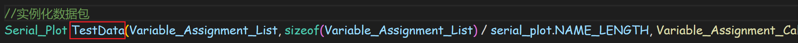

# 串口绘图通信

作者：**刘煜川**		日期：**2021.11.10**

## 目的

使用SerialPlot软件实现串口绘图显示和参数整定

## 过程

从[RM_cplusplus_demo: RM C++架构 测试 (gitee.com)](https://gitee.com/Glorill/rm_cplusplus_demo)clone代码

本次实验需要关注的文件是


+ Service_Debug.cpp 这是写测试代码的线程
+ Serial_PLot.cpp 这是我们队内通用的串口绘图库

### Service_Debug.cpp

先打开Service_Debug.cpp

```c
void Service_Debug_Init(void)
{
    xTaskCreate(Task_Debug,          /* Task function. */
                "Debug_Service",     /* Task Name. */
                Normal_Stack_Size,   /* Stack depth. */
                NULL,                /* Task parameter */
                PriorityBelowNormal, /* Priority */
                &Debug_Handle);      /* Task handle */
}
```

这个函数初始化了一个叫做Task_Debug的线程，一个线程就类似于一个主函数，但他可以独立运行。

```c
void Task_Debug(void *arg)
{
    for (;;)
    {
        static uint16_t prescale=0;
        if(prescale++>=10)
        {
            prescale = 0;

        }
        
        vTaskDelay(1);  // Pass to next ready task
    }
}
```

下面就是这个线程（函数）的内容，死循环前可以写一些只用运行一次的语句，然后进入死循环后用prescale写了一个分频，不需要的时候也可以删掉，最后vTaskDelay(1);产生一个1ms的延时，使得这个循环的频率为1kHz，而分频内的频率为100Hz。

vTaskDelay()有别于HAL_Delay()，前者是非阻塞式的，进入延时的时候实际上是让CPU去处理别的线程，由此实现多线程并行。

我们的测试代码将写在Task_Debug这个函数里。

### Serial_PLot.cpp

然后打开Serial_PLot.cpp

关注文件的开头“How to use this library”，仔细看下面的note

在第一个note中他让我们调用这句来初始化，不过这个工程模板中已经初始化好了，就不需要了

在第二个note中他让我们仿写这一段，于是复制粘贴过去


放到Service_Debug.cpp开头的位置


复制过来的内容有4个部分，前两个用于调参，第三个用于绘图，最后一个是初始化数据包

最后一行的变量名可以改，我们改成TestData



在第三个note中他让我们调用这句来发送


我们在线程中调用一下，变量名使用我们刚才命名的TestData，将这句话放在分频内以100Hz发送，否则1kHz的话目前配置的115200的串口波特率不够。

### 准备需要收发的数据

现在就看你想要收发什么数据了，比如显示一些按三角函数变化的参数。

在Service_Debug.cpp开头定义一些全局变量用来观察，这里以三角函数为例。


在线程中写一下三角函数计算，文件开头添加\#include "math.h"


将想要绘图显示的5个变量写到第三处，将想要调参的2个变量写到第二处，对应的名字按顺序写在第一处（名字仅仅用于串口绘图软件发送的赋值指令，不需要和变量名一致）


编译下载

### 使用SerialPlot

打开SerialPlot，加载配置，选择根目录下的“串口配置-云台调试.ini”文件


修改这里的数据为5和4*5，因为我们刚才发送了5个数据


选择串口，打开，显示所有波形，就能看到变量变化了


为了便于观察，我们把第一路数据t关掉


打开Commands选项卡，把之前的指令删了


比如写“w=2”发送，就能把w修改为2，可以看到数据周期变化了


波形回看，放大，标尺设置等都比较人性化，软件别的功能就自由探索吧。

## 后记

我们战车各个模块的代码（比如云台、底盘）的开头都有都有一段这个串口绘图数据的配置代码，用来写调试这个模块时需要观察、调参的数据，以便于调试。