# 有限状态机

作者：**刘煜川**		日期：**2021.12.2**

## 目的

控制电机完成一个复杂的工作流程：受外力控制，正向拨动后正转，反向拨动后反转，按住停转。

## 概念

### 阻塞式与非阻塞式

阻塞式是必须等一个阻塞条件解除后才能继续执行的代码。比如说这样一个读取传感器数据的流程：

```c
float GetSensorData(void)
{
    sensorON();//打开传感器
    delay(1000);//延时1秒
    while(!sensorDateIsOK())//每隔1ms询问传感器数据准备情况
        delay(1);
    sensorOFF();//关闭传感器
    return sensorData;
}
```

就是一个阻塞式的流程写法，那么当某个线程调用GetSensorDate这个函数时，线程就会被阻断，直到拿到数据。

那么假如你有要同时操作多个传感器1、2、3，就没法这样调用函数，因为这样的代码每个时刻只能操作其中一个传感器。

```c
void main(void)
{
    while(1)
    {
        GetSensorDate1();
        GetSenserDate2();
        GetSenserDate3();
    }
}
```

究其原因，阻塞的发生是来自于delay( )函数，delay( )让CPU进入了空闲状态，就发生了阻塞。

那如何避免使用delay( )又能写出带有时序的操作呢，或者说实现延时，没错就是用定时器。

打开一个1ms的定时器中断，在里面调用操作函数，这个函数里面就需要用非阻塞式的写法。

```c
unsigned int SenserStep=0;
void SensorControl(void)
{
    static unsigned int SenserCount;
    if(SenserStep == 0)
    {
    	sensorON();	//打开传感器
        SenserCount=1000;	//初始化计时变量
        SenserStep++;	//下一步骤
    }
    else if(SenserStep == 1)	//延时1秒
    {
        if(SenserCount > 0)	//等待计时值减到0
			SenserCount--;
        else SenserStep++;	//下一步骤
    }
    else if(SenserStep == 2)	//等待数据
    {
        if(sensorDateIsOK())	//询问传感器数据准备情况
        {
            SaveData();	//保存传感器数据
            sensorOFF();	//关闭传感器
            SenserStep=3;	//下一步骤
        }
    }
}
```

在这里用SenserStep标识正在进行的步骤，每隔1ms调用SensorControl时，根据SenserStep决定此时运行哪个步骤，或者进行什么跳转，这就是一个简单的有限状态机。

### 有限状态机的实现

有限状态机是表示有限个状态以及在这些状态之间的转移和动作等行为的数学模型。

上文代码写得比较草率，这里给出一种代码实现的标准：

+ 使用一个枚举类型的变量描述系统所处的状态
+ 在循环调用中，使用一个switch-case根据现在所处的状态，运行状态下的语句以及状态跳转的条件
+ 如果需要计时、延时、计数，需要增加一个变量来计数

下面用电机控制作为例子。

## 过程

继续使用你的之前实现了6020转速控制的工程，或者用这里现成的

[RM_cplusplus_demo: RM C++架构 测试 - Gitee.com](https://gitee.com/Glorill/rm_cplusplus_demo/tree/6020速度控制/)

这是实验教程下的一个分支，可以再clone一个


也可以在vscode或者git命令行直接切换（checkout）到这个远程仓库的分支，然后拉取下来

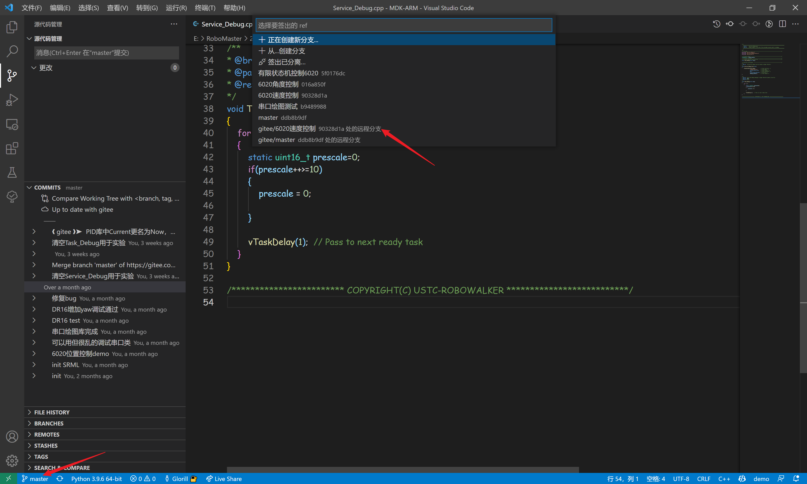

回顾一下要实现的效果：**受外力控制，正向拨动后正转，反向拨动后反转，按住停转。**

如何知道电机被拨动，可以看电机反馈的转速，也可以看电机反馈的电流。这里选择用电流，当静态平衡的时候，电流基本上与电机输出力矩成正比。

我们把速度控制的代码编译下载，打开SerialPlot，设置一下数据。

一开始预期转速是0，电机不会转动，但是会有回复的力矩，我们用手拨动一下电机，可以看到电机的电流与我们施加的外力基本是正相关的。实际上是，我们施加外力的时候，PID控制的结果会输出这样的电流，电流产生的力矩与我们的力平衡，使得电机维持0的速度。

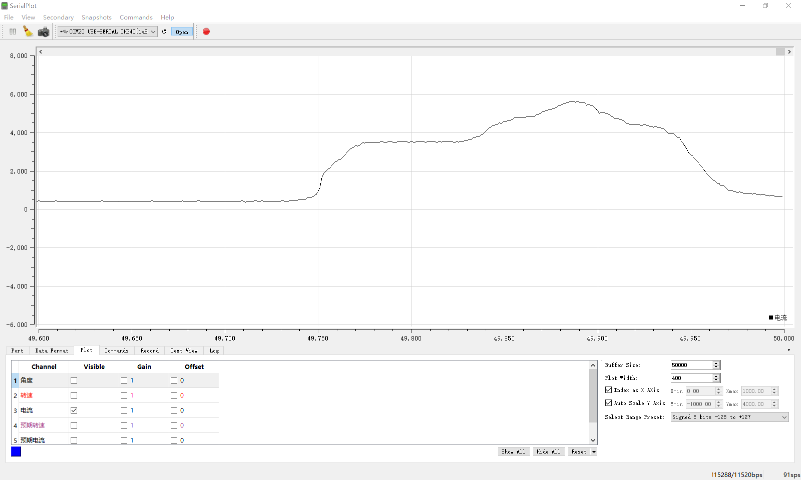

也就是说根据电流的大小一定程度就能反映外力的大小，这里也可以记录一下，多大的力对应多大的电流。

那么如果在正向电流超过某个阈值的时候，让电机开始反转；反向电流超过某个阈值的时候，让电机开始正转。

具体多大，根据刚才测量的情况看，可以取800。

那何时让电机停转呢，我们给一个15的预期速度，让电机转动起来，电流的平均值在300左右，然后施加外力阻碍转动，可以看到增加的电流也基本和外力矩成正比。

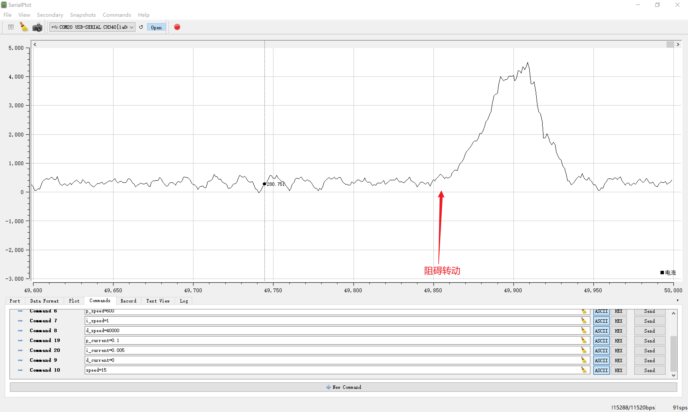

所以可以在电流过大的时候，让电机停转，可以取1500。

那么来简单画一下状态转换图。

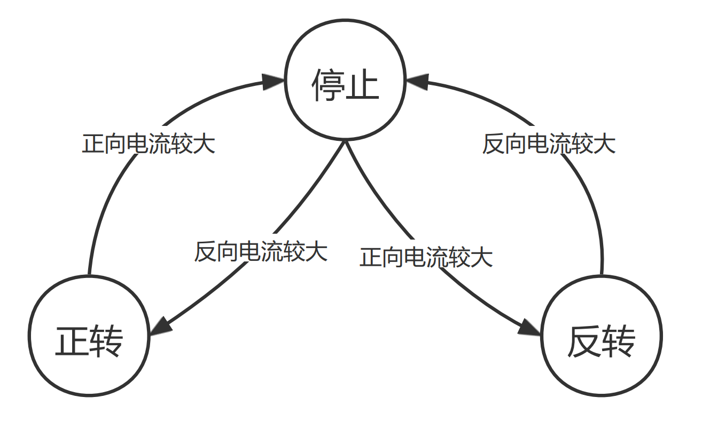

状态总共有3个，在不同的条件会发生跳转。

定义一个全局的枚举类型变量，来标识这些状态。

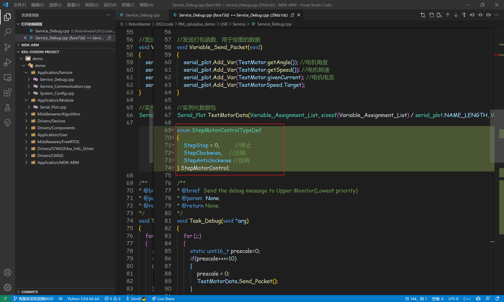

```c
enum StepMotorControlTypeDef
{
    StepStop = 0,         //停止
    StepClockwise,    //正转
    StepAnticlockwise //反转
} StepMotorControl;
```

在线程的循环中，写一个switch-case，不同状态执行不同的代码，与上面的状态转换图完全对应，就不多说了。

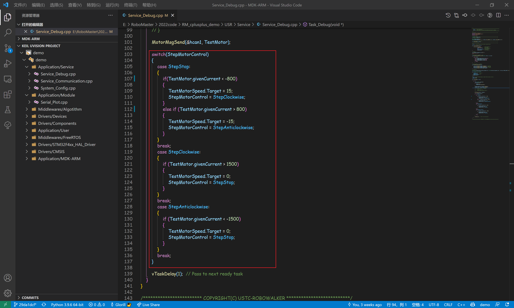

```c
		switch(StepMotorControl)
        {
            case StepStop:
            {
                if(TestMotor.givenCurrent < -800)
                {
                    TestMotorSpeed.Target = 15;
                    StepMotorControl = StepClockwise;
                }
                else if (TestMotor.givenCurrent > 800)
                {
                    TestMotorSpeed.Target = -15;
                    StepMotorControl = StepAnticlockwise;
                }
            }
            break;
            case StepClockwise:
            {
                if (TestMotor.givenCurrent > 1500)
                {
                    TestMotorSpeed.Target = 0;
                    StepMotorControl = StepStop;
                }
            }
            break;
            case StepAnticlockwise:
            {
                if (TestMotor.givenCurrent < -1500)
                {
                    TestMotorSpeed.Target = 0;
                    StepMotorControl = StepStop;
                }
            }
            break;
        }

```

编译下载，现在正向拨动一下电机，电机会正转起来，反向拨动，电机会反转。这张图上转速放大了10倍，便于观察。

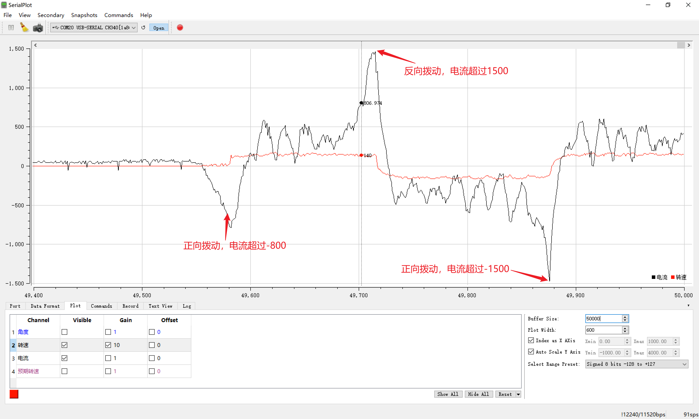

但是电机为什么停不下来呢，我们看一下停止时的情况，比如此时正在正转，当正向电流超过了1500，那么预期速度会被置0，进入StepStop状态，在StepStop状态下，电流大于800的话会立即进入反转状态，这样就直接略过了停止状态。

那么如何让电机能停下呢，可以给电机减速一点时间，增加一个减速状态，来等待电机完成减速。

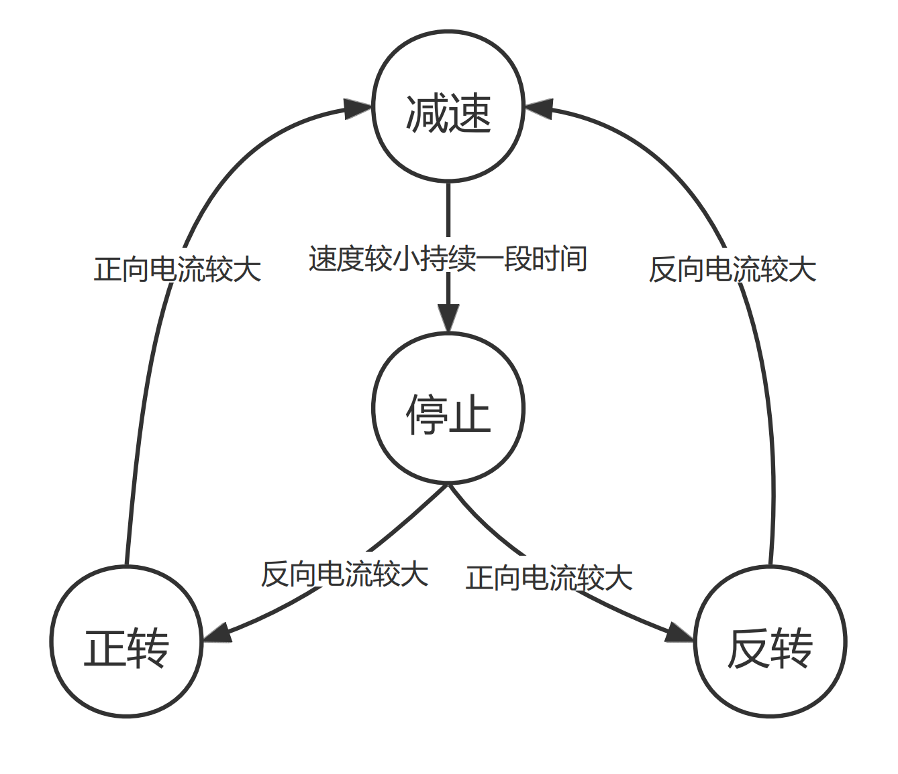

增加一个减速状态的，再增加一个计数变量用来计时。

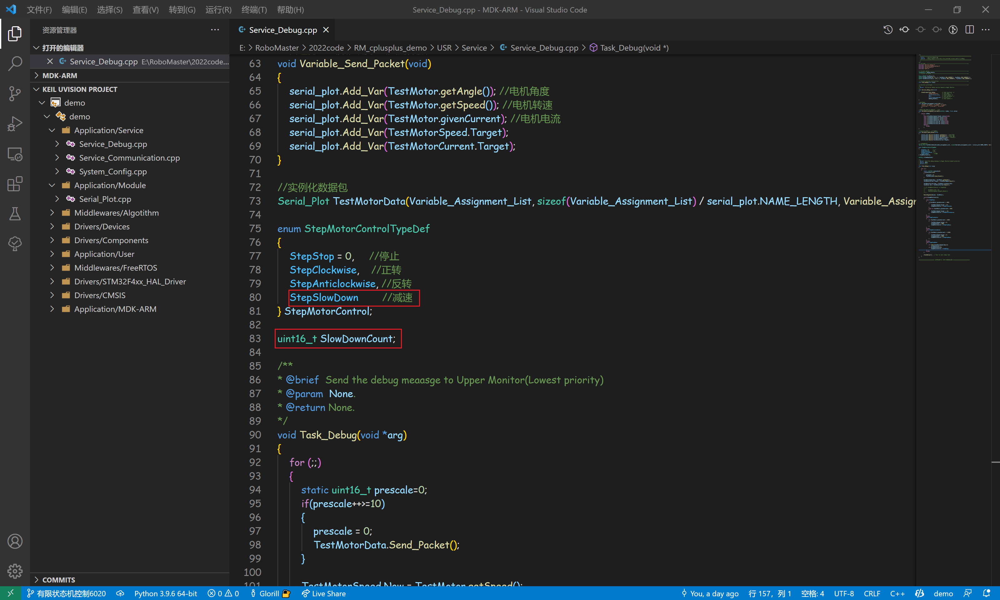

修改正转和反转时，电流过大跳转到减速状态，并为计数赋初始值。

在减速状态下，如果速度减小到2以下，让计数值减1，直到减到0才进入停止状态。

由于线程的频率是1ms，所以计数值减1000需要1秒，也就是当转速小于2维持了1秒钟，才会切换到停止状态。

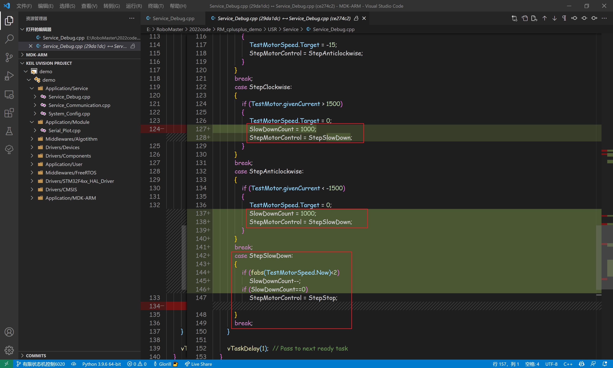

编译下载，此时就能比较好地实现我们需要的效果了。

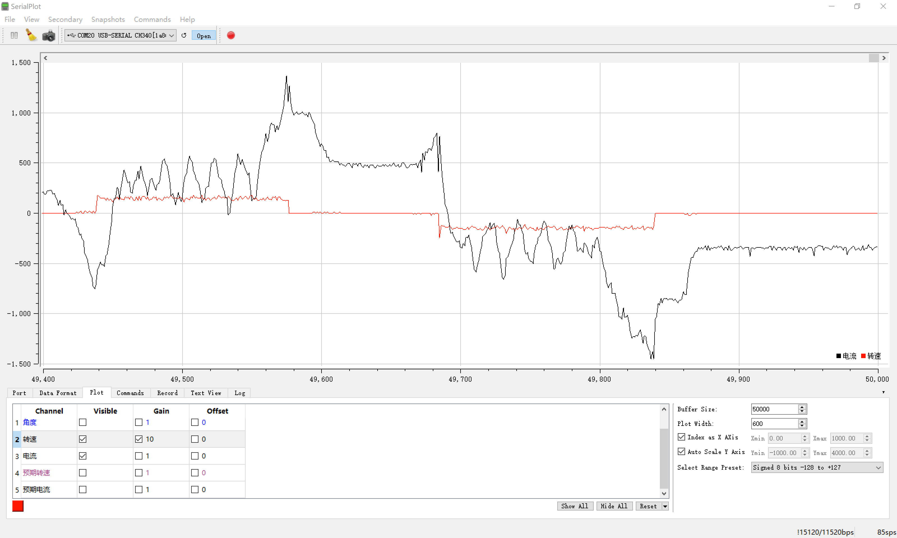

## 后记

有限状态机的用途十分广泛，特别是需要写一些工作流程时，比如复杂的通信协议、工程机器人的运动机构协调控制、哨兵机器人的自动控制流程。

有限状态机的写法非常灵活，我们写代码时经常定义xx_flag这样的变量，其实跟有限状态机的思想是一致的。

